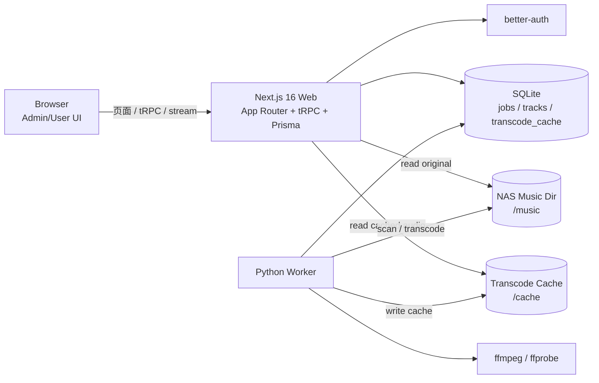
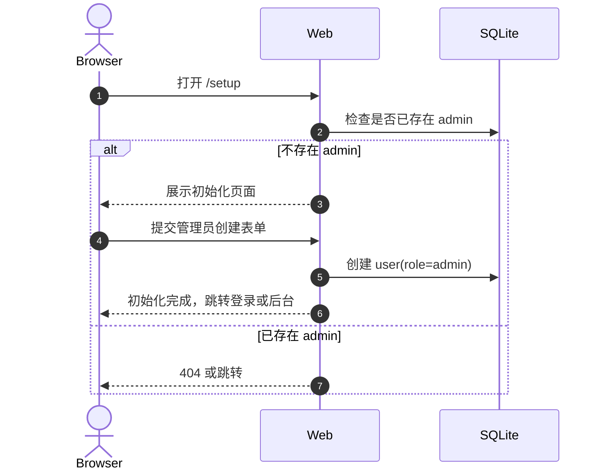
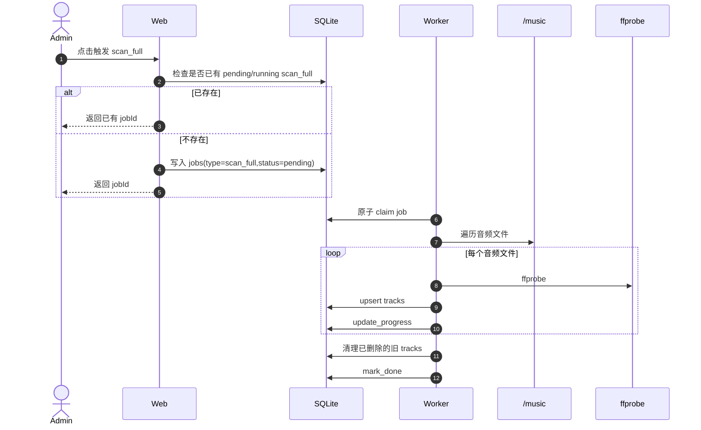
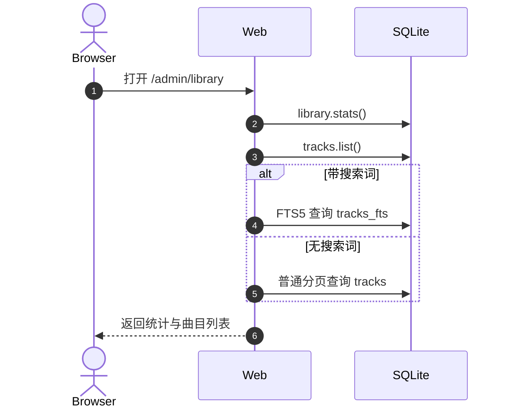
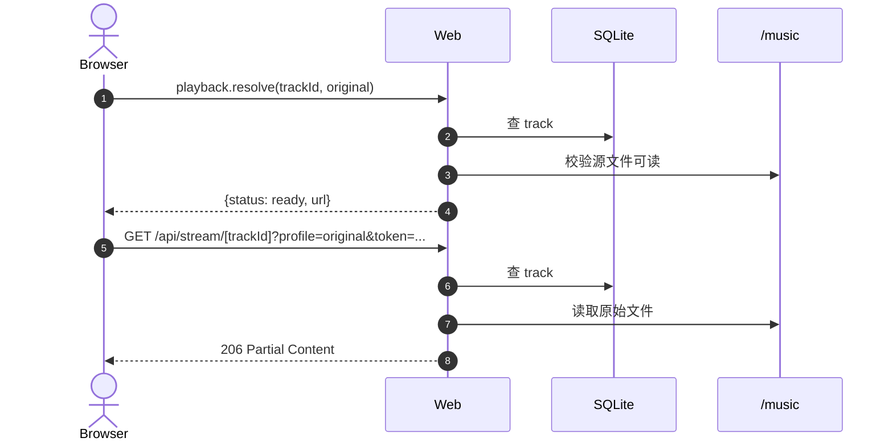
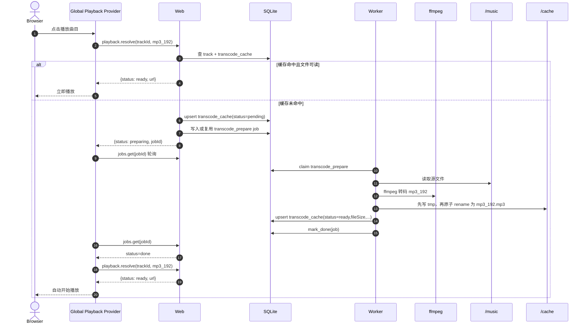
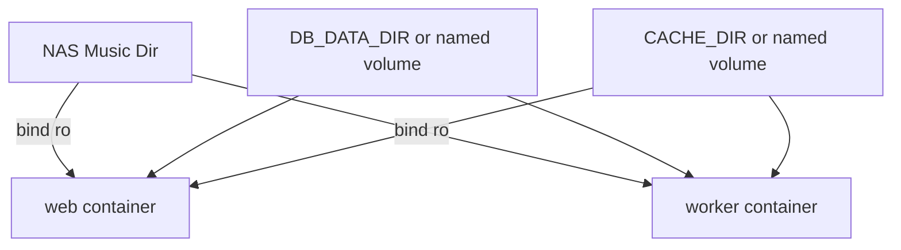

# 系统架构说明

本文档描述当前仓库的真实运行架构，重点覆盖：

- Web、Worker、SQLite、音乐目录、转码缓存之间的关系
- `scan_full`、曲库浏览、原始播放、`mp3_192` 转码缓存播放的完整流转
- Docker 部署下的数据与缓存持久化边界

如果你要先快速掌握项目全貌，建议按这个顺序阅读：

1. 架构总览
2. 关键数据表
3. 四条核心业务链路
4. 生产环境的持久化与运维要点

## 1. 当前范围

当前已完成的主线能力：

- 首次管理员初始化
- better-auth 登录与角色控制
- `scan_full` 后台任务
- SQLite 曲库索引与 FTS 搜索
- 全局原始音频播放
- `mp3_192` 转码缓存播放

当前尚未完成：

- 设置页
- Plan/预览/执行工作流
- Dashboard / Jobs 当前播放摘要
- 播放模式：顺序 / 随机 / 单曲循环

## 2. 架构总览

### 2.1 运行组件

### 2.2 分层职责

- 浏览器：
  - 渲染后台页面
  - 调用 tRPC 过程
  - 使用全局播放器消费 `/api/stream/[trackId]`
- Web：
  - 渲染页面与管理 UI
  - 通过 better-auth 处理登录态
  - 通过 tRPC 提供业务控制面
  - 通过 Prisma 直接读写 SQLite
  - 通过 Route Handler 输出支持 `Range` 的音频流
- Worker：
  - 轮询 `jobs`
  - 执行 `scan_full`
  - 执行 `transcode_prepare`
  - 回写 `jobs`、`tracks`、`transcode_cache`
- SQLite：
  - 作为当前唯一业务数据库
  - 保存认证数据、任务队列、曲库索引、转码缓存索引
- 音乐目录 `/music`：
  - Web 读取原始音频
  - Worker 扫描与转码读取源文件
- 缓存目录 `/cache`：
  - Worker 写入转码结果
  - Web 读取缓存音频输出流

## 3. 代码结构

### 3.1 `web/`

- `app/`：Next.js App Router 页面与 Route Handler
- `server/trpc/`：tRPC 路由与鉴权中间件
- `components/playback/`：全局播放器与播放状态管理
- `lib/`：认证、Prisma、播放 token/路径解析等基础能力
- `prisma/`：Schema 与 migrations

### 3.2 `worker/`

- `worker.py`：主循环、SQLite 重连、job dispatch
- `jobs.py`：job claim / heartbeat / progress / done / failed
- `scanner.py`：全量扫描与 `tracks` 写入
- `transcoder.py`：`mp3_192` 转码、原子写入缓存、`transcode_cache` 回写

## 4. 关键数据表

### 4.1 `jobs`

用于所有后台任务的统一队列。

关键字段：

- `id`
- `type`：当前已有 `scan_full`、`transcode_prepare`
- `status`：`pending | running | done | failed`
- `payloadJson`
- `progress`
- `attempts`
- `maxAttempts`
- `lockedBy / lockedAt / heartbeatAt`
- `errorJson`

### 4.2 `tracks`

保存音乐文件索引与基础元数据。

关键字段：

- `id`
- `path`
- `filename`
- `mtimeMs`
- `durationMs`
- `title / artist / album`
- `updatedAt`

### 4.3 `transcode_cache`

保存转码缓存的数据库索引，不直接存音频内容。

关键字段：

- `trackId`
- `profile`
- `sourceMtimeMs`
- `cachePath`
- `contentType`
- `fileSize`
- `status`
- `errorJson`

唯一键：

- `trackId + profile + sourceMtimeMs`

这意味着：

- 同一首歌、同一档位、同一源文件版本，只会有一条有效缓存记录
- 源文件 `mtimeMs` 变化后，旧缓存自然失效，新版本重新生成

## 5. 鉴权与权限边界

### 5.1 页面与 tRPC

- 登录态由 better-auth session cookie 驱动
- tRPC `protectedProcedure` 负责要求用户已登录
- tRPC `adminProcedure` 负责要求管理员权限

当前权限边界：

- 管理员：
  - `/setup` 后的管理入口
  - `scan_full`
  - `jobs.list`
  - `jobs.get`
- 已登录用户：
  - 曲库浏览
  - 搜索
  - 播放

### 5.2 流媒体接口

`/api/stream/[trackId]` 不走 tRPC，原因是它必须处理 `Range`。

它会校验：

- 当前 request 的登录态
- 短期 token 是否有效
- token 中的 `userId / trackId / profile` 是否与当前请求一致

## 6. 核心链路

## 6.1 管理员初始化

## 6.2 `scan_full` 链路

说明：

- `scan_full` 在 Web 侧做了去重
- Worker 侧通过 `BEGIN IMMEDIATE` + 条件更新避免双领
- Worker 当前会在轮询阶段主动刷新 SQLite 连接，降低开发环境连接陈旧问题

## 6.3 曲库浏览与搜索链路

说明：

- 搜索优先走 FTS5
- 如果本地缺少 FTS 表，会回退到普通 `contains` 查询

## 6.4 原始播放链路

说明：

- `resolve` 只是返回“可播放地址”
- 真正的字节流由 `/api/stream/[trackId]` 输出
- token 与登录态双重校验，避免裸链

## 6.5 `mp3_192` 转码缓存播放链路

说明：

- 当前默认远程播放档位已经切到 `mp3_192`
- preparing 状态由全局播放器统一持有，因此切换后台页面不会丢状态
- 若转码失败，前端会展示明确错误，不自动回退到 `original`

## 7. 当前播放实现

### 7.1 为什么播放器要做成全局

当前播放器挂在 `(app)` 级别的 layout 里，而不是某一个页面里。

这样可以保证：

- 在 `/admin`、`/admin/library`、`/admin/jobs` 间切页时不停止播放
- `preparing` 轮询状态不会在页面卸载时丢失
- 曲库页只负责选歌和高亮，不负责持有 `<audio>`

### 7.2 当前前端状态

全局播放状态至少包含：

- `queue`
- `currentTrack`
- `activePlayback`
- `pendingTrackId`
- `isPreparing`
- `isAudioPlaying`
- `playbackError`

## 8. Docker 与持久化边界

### 8.1 当前生产拓扑

结论：

- 数据库可以持久化
- 转码缓存也可以持久化
- 只要不删除 volume 或不更换宿主机目录，容器重建、镜像升级都不会丢缓存

### 8.2 当前 compose 的真实行为

在生产 compose 中：

- `web` 挂载 `/cache`
- `worker` 也挂载 `/cache`
- 二者共享同一份 `CACHE_DIR`

因此：

- Worker 生成的缓存，Web 可以直接读取
- 缓存与镜像层解耦，不依赖容器文件系统内部状态

## 9. 运维建议

### 9.1 推荐的生产配置

对生产环境，更推荐把下面两项都指向 NAS 宿主机绝对路径，而不是默认 named volume：

- `DB_DATA_DIR`
- `CACHE_DIR`

这样好处是：

- 备份路径清晰
- 直接观察数据库与缓存文件更容易
- 容器迁移或更换 compose 项目名时更稳

### 9.2 备份优先级

优先备份：

1. 数据库目录
2. 生产环境变量文件
3. 转码缓存目录

其中：

- 数据库是必须备份
- 转码缓存不是唯一数据源，但能显著减少重新转码成本

### 9.3 缓存失效策略

当前缓存失效策略很简单：

- 只要 `tracks.mtimeMs` 改变，就认为源文件版本变了
- 新版本会重新生成缓存
- 旧版本缓存不会自动删除，但也不会再被命中

这意味着当前版本更偏“安全与正确”，还没有进入“缓存清理与配额管理”阶段。

## 10. 你后续读代码时建议重点看哪里

如果你想理解播放链路，优先看：

1. [`web/components/playback/global-playback-provider.tsx`](/Users/namehu/github/music-tagger/web/components/playback/global-playback-provider.tsx)
2. [`web/server/trpc/routers/playback.ts`](/Users/namehu/github/music-tagger/web/server/trpc/routers/playback.ts)
3. [`web/app/api/stream/[trackId]/route.ts`](/Users/namehu/github/music-tagger/web/app/api/stream/[trackId]/route.ts)
4. [`worker/transcoder.py`](/Users/namehu/github/music-tagger/worker/transcoder.py)

如果你想理解后台任务，优先看：

1. [`worker/jobs.py`](/Users/namehu/github/music-tagger/worker/jobs.py)
2. [`worker/worker.py`](/Users/namehu/github/music-tagger/worker/worker.py)
3. [`web/server/trpc/routers/jobs.ts`](/Users/namehu/github/music-tagger/web/server/trpc/routers/jobs.ts)

如果你想理解数据层，优先看：

1. [`web/prisma/schema.prisma`](/Users/namehu/github/music-tagger/web/prisma/schema.prisma)
2. [`web/prisma/migrations`](/Users/namehu/github/music-tagger/web/prisma/migrations)
