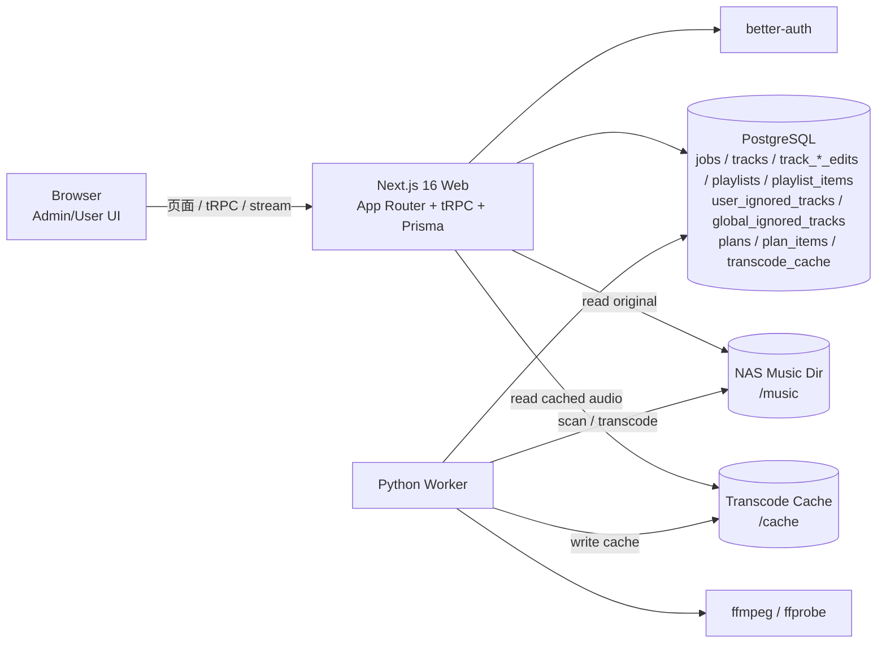
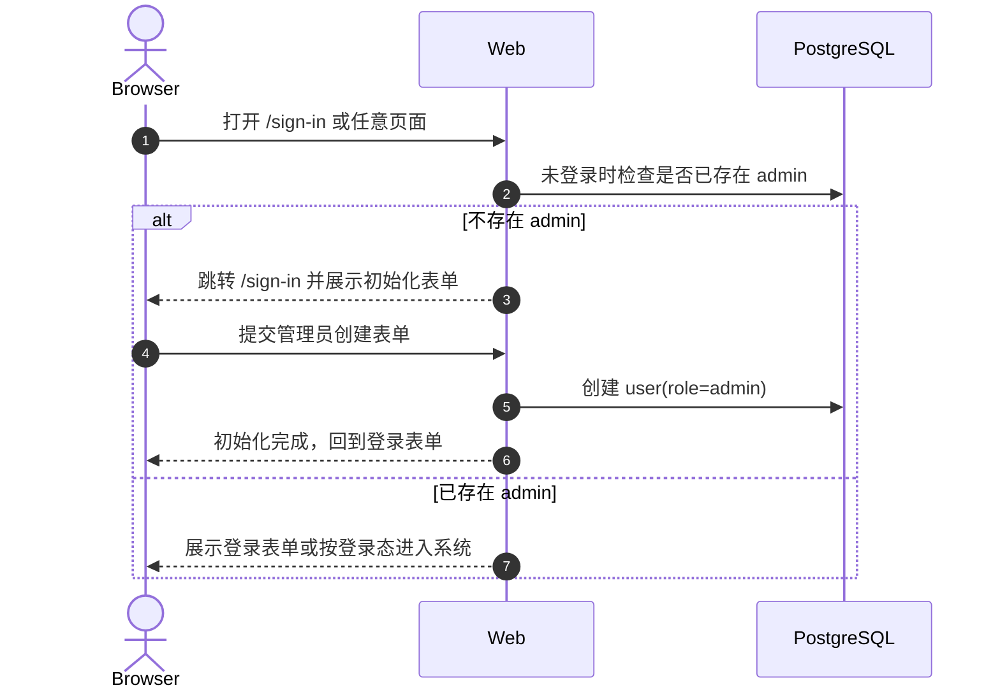
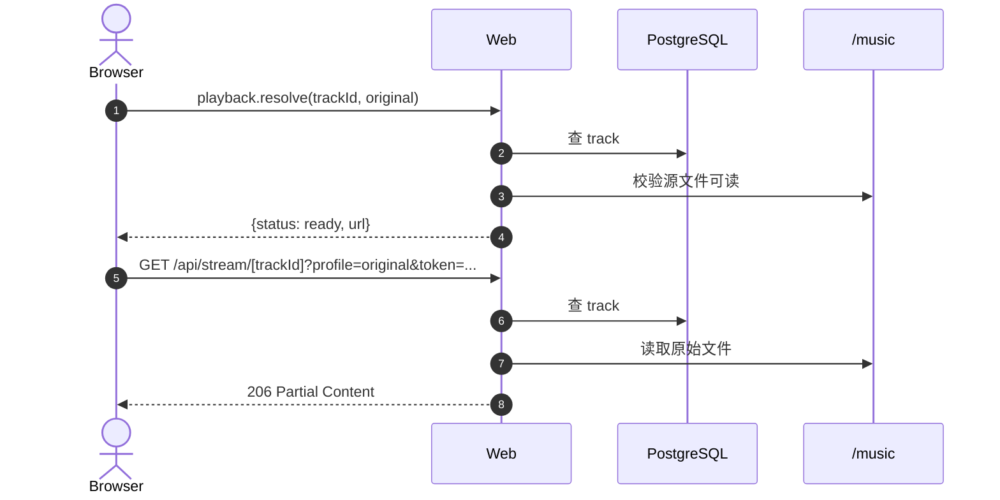
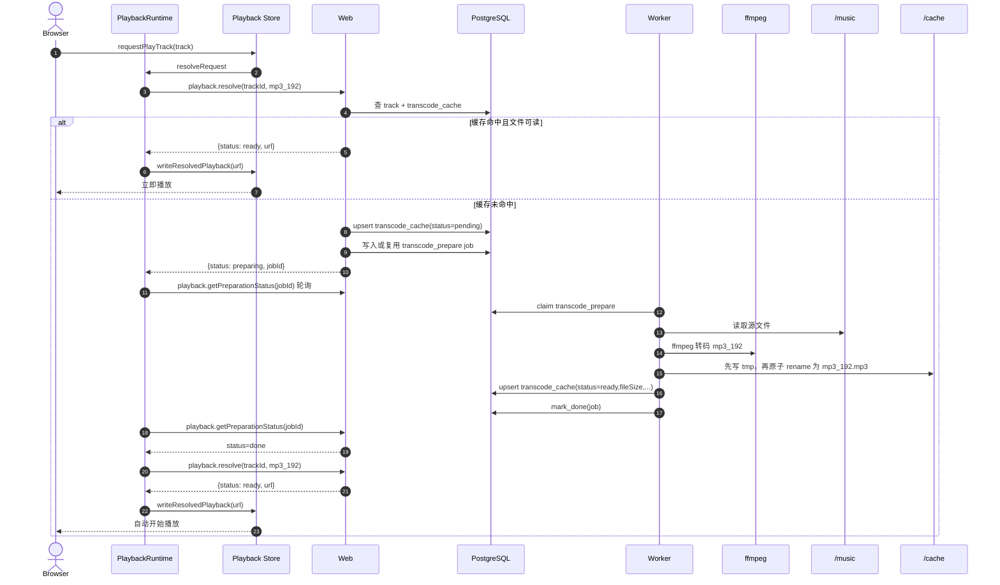
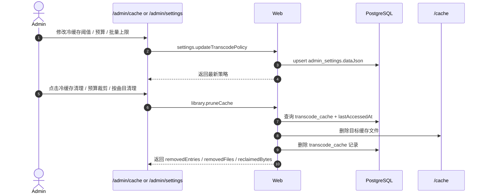
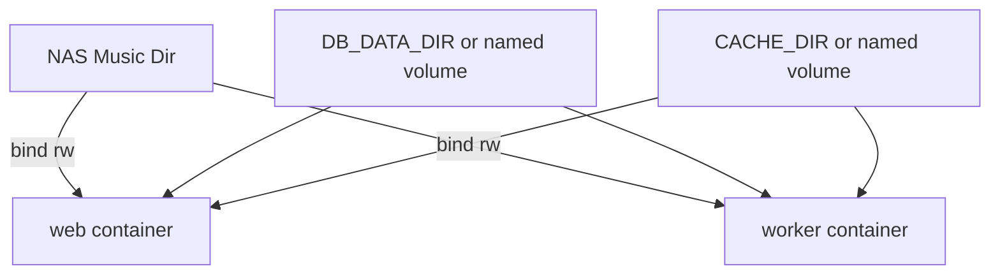

# 系统架构说明

本文档描述当前仓库的真实运行架构，重点覆盖：

- Web、Worker、PostgreSQL、音乐目录、转码缓存之间的关系
- `scan_full`、曲库浏览、原始播放、`mp3_192` 转码缓存播放 / 边转边播的完整流转
- Docker 部署下的数据与缓存持久化边界

如果你要先快速掌握项目全貌，建议按这个顺序阅读：

1. 架构总览
2. 关键数据表
3. 四条核心业务链路
4. [`docs/architecture/playback-runtime-and-modes.md`](/Users/namehu/github/music-tagger/docs/architecture/playback-runtime-and-modes.md)
5. 生产环境的持久化与运维要点

## 1. 当前范围

当前已完成的主线能力：

- 首次管理员初始化
- better-auth 登录与角色控制
- 登录后用户区入口：`/dashboard`、`/library`、`/playlists`、`/ignored-tracks`
- 用户首页聚合：继续收听、最近播放、最近更新歌单、最近更新曲目
- `scan_full` 后台任务
- PostgreSQL 曲库索引与搜索
- 全局原始音频播放
- `mp3_192` 转码缓存播放
- 冷缓存 `mp3_192` 达到最小起播阈值后的边转边播
- `zustand` 全局播放状态、顺序 / 随机 / 单曲循环模式
- 用户侧当前队列抽屉、Up Next、队列跳播、单首移除与清空队列
- 浏览器本地播放会话恢复（刷新后默认暂停）
- 个人歌单 CRUD、加歌、移歌与按保存顺序点播
- 双层忽略曲目：用户“我的忽略”与管理员“全局忽略”
- 管理员单曲编辑：元数据、歌词、封面先写数据库，再异步回写文件
- 转码观测、缓存容量治理与后台策略配置

当前尚未完成：

- 更高阶的文件整理动作主流程

## 2. 架构总览

### 2.1 运行组件

### 2.2 分层职责

- 浏览器：
  - 渲染用户页面与后台页面
  - 调用 tRPC 过程
  - 使用全局播放器消费 `/api/stream/[trackId]`
  - 在用户侧底部播放器中展示当前队列、Up Next 与队列编辑动作
- Web：
  - 渲染用户区与管理区 UI
  - 通过 better-auth 处理登录态
  - 通过 tRPC 提供业务控制面
  - 通过 `library.dashboard` 聚合用户首页数据
  - 通过 `trackEdits` router 与 `/api/admin/tracks/[trackId]/cover` 处理 DB-first 编辑
  - 管理员上传封面时，直接把文件写到音频同目录、同 basename 的 `.jpg/.png` sidecar
  - `trackEdits.get` 会一并返回每个编辑域最近一次同步任务摘要，供编辑面板直接展示最近结果与排障建议
  - 通过 Prisma 直接读写 PostgreSQL
- 通过 Route Handler 输出支持 `Range` 的音频流
- 对完整缓存和原始流继续输出支持 `Range` 的音频流；对 live transcode 输出 chunked `audio/mpeg`
- Worker：
  - 轮询 `jobs`
  - 执行 `scan_full`
  - 执行 `transcode_prepare`
  - 执行 `track_edit_sync`
  - 执行 `plan_execute`
  - 回写 `jobs`、编辑同步状态、`plans`、`plan_items`、`transcode_cache`
  - `scan_full` 优先读取音频同目录 sidecar；没有 sidecar 时，从嵌入封面提取并落地 sidecar
- PostgreSQL：
  - 作为当前唯一业务数据库
  - 保存认证数据、任务队列、曲库索引、歌单数据、忽略曲目关系、Plan 数据与转码缓存索引
- 音乐目录 `/music`：
  - Web 读取原始音频，并把管理员上传的封面直接写成音频同目录 sidecar
  - Worker 扫描与转码读取源文件
  - Worker 在没有 sidecar 时，会把已有嵌入封面提取为音频同目录 sidecar
- 缓存目录 `/cache`：
  - Worker 写入转码结果
  - Web 读取缓存音频输出流

## 3. 代码结构

### 3.1 `web/`

- `app/`：Next.js App Router 页面与 Route Handler
- `server/trpc/`：tRPC 路由与鉴权中间件
- `components/playback/`：全局播放器与播放状态管理
- `store/`：`zustand` 全局状态与 computed middleware
- `components/shell/`：后台导航、顶栏与管理壳
- `components/library/`：用户区与管理区共享的曲库浏览组件
- `lib/`：认证、Prisma、播放 token/路径解析等基础能力
- `prisma/`：Schema 与 migrations

### 3.2 `worker/`

- `worker.py`：主循环、PostgreSQL 连接、job dispatch
- `jobs.py`：job claim / heartbeat / progress / done / failed
- `scanner.py`：全量扫描与 `tracks` 写入
- `scanner.py`：全量扫描与 `tracks` 写入，同时优先读取音频同目录 sidecar，并在没有 sidecar 时提取已有嵌入歌词 / 封面观察值
- `plan_executor.py`：Plan 执行器，保留历史 `rename`、`move` 与基础 `tag_write`
- `track_edit_sync.py`：DB-first 曲目编辑异步写回执行器
- `transcoder.py`：`mp3_192` 转码、`.partial` 持续写入、完成后原子切换为正式缓存、`transcode_cache` 回写

## 4. 关键数据表

### 4.1 `jobs`

用于所有后台任务的统一队列。

关键字段：

- `id`
- `type`：当前已有 `scan_full`、`transcode_prepare`、`track_edit_sync`、`plan_execute`
- `status`：`pending | running | done | failed`
- `payloadJson`
- `progress`
- `attempts`
- `maxAttempts`
- `lockedBy / lockedAt / heartbeatAt`
- `errorJson`

### 4.2 `tracks`

保存音乐文件索引与基础元数据。

关键字段：

- `id`
- `path`
- `filename`
- `mtimeMs`
- `durationMs`
- `title / artist / album`
- `updatedAt`

### 4.3 `track_metadata_edits` / `track_lyrics_edits` / `track_cover_edits`

保存管理员编辑真值与同步状态。

关键字段：

- `trackId`
- 元数据字段或歌词正文 / 音乐目录内封面 sidecar 路径
- `syncStatus`
- `syncErrorJson`
- `syncRequestedAt / syncStartedAt / syncFinishedAt`

业务规则：

- Web 保存后先写 edit 表，前端立即以 edit 真值显示
- worker 再通过 `track_edit_sync` 异步回写物理音频文件
- `scan_full` 只更新扫描观察值，不覆盖 edit 真值
- `scan_full` 会把已有嵌入歌词正文和封面同步到观察值；封面观察值优先使用音频同目录 sidecar，没有 sidecar 时才从嵌入封面提取，编辑面板在没有 edit 真值时回退展示这些扫描值

### 4.4 `plans`

保存整理计划的顶层元数据。

关键字段：

- `id`
- `createdById`
- `type`：历史记录里当前可见 `rename`、`tag_write`、`move`
- `scopeJson`
- `paramsJson`
- `previewSummaryJson`
- `warningsJson`
- `status`
- `status`：当前可能为 `pending | streaming | ready | failed | cancelled`
- `executionJobId`

### 4.5 `playlists` / `playlist_items`

保存用户个人歌单与歌单内曲目顺序。

关键字段：

- `playlists.id / userId / name`
- `playlist_items.id / playlistId / trackId / position`

### 4.6 `user_ignored_tracks` / `global_ignored_tracks`

保存双层忽略关系。

关键字段：

- `user_ignored_tracks.id / userId / trackId / createdAt`
- `global_ignored_tracks.id / trackId / createdById / reason / createdAt`

业务规则：

- `global_ignored_tracks.trackId` 全局唯一，同一首歌最多只有一条全局忽略记录
- `user_ignored_tracks.userId + trackId` 联合唯一，同一用户不会重复忽略同一首歌
- 默认曲库可见性遵循 `全局忽略 > 我的忽略 > 正常`
- 用户区默认过滤 `global + mine`
- 管理区默认过滤 `global`

### 4.7 `plan_items`

保存 Plan 拆分后的单项执行记录。

关键字段：

- `id`
- `planId`
- `kind`
- `trackId`
- `fromPath / toPath`
- `tagDiffJson`
- `warningsJson`
- `status`
- `errorJson`

### 4.8 `transcode_cache`

保存转码缓存的数据库索引，不直接存音频内容。

关键字段：

- `trackId`
- `profile`
- `sourceMtimeMs`
- `cachePath`
- `contentType`
- `fileSize`
- `status`
- `errorJson`
- `lastAccessedAt`

唯一键：

- `trackId + profile + sourceMtimeMs`

这意味着：

- 同一首歌、同一档位、同一源文件版本，只会有一条有效缓存记录
- 源文件 `mtimeMs` 变化后，旧缓存自然失效，新版本重新生成
- `lastAccessedAt` 用于区分冷缓存与近期命中缓存，支撑容量治理
- `streaming` 表示 worker 正在写 `.partial`，web 可以在 `fileSize` 达到阈值后直接边读边播

### 4.9 `admin_settings`

当前除了初始化锁状态，也承载轻量后台策略配置。

当前已落地的配置项：

- `transcodePolicy.coldCacheDays`
- `transcodePolicy.budgetBytes`
- `transcodePolicy.pruneLimit`

这些值由 `/admin/settings` 修改，并被 `/admin/cache` 的默认清理动作直接消费。

## 5. 鉴权与权限边界

### 5.1 页面与 tRPC

- 登录态由 better-auth session cookie 驱动
- tRPC `protectedProcedure` 负责要求用户已登录
- tRPC `adminProcedure` 负责要求管理员权限

当前权限边界：

- 管理员：
  - 进入用户区
  - 从右上角进入 `/admin`
  - `/sign-in` 初始化完成后的管理入口
  - `scan_full`
  - `jobs.list`
  - `jobs.get`
  - 全局忽略曲目查看、设置与解除
  - `plans.*`
- 已登录用户：
  - `/dashboard`
  - 曲库浏览
  - 搜索
  - 播放
  - 个人歌单 CRUD 与歌单点播
  - 我的忽略查看、设置与解除

### 5.2 流媒体接口

`/api/stream/[trackId]` 不走 tRPC，原因是它必须处理 `Range`。

它会校验：

- 当前 request 的登录态
- 短期 token 是否有效
- token 中的 `userId / trackId / profile` 是否与当前请求一致

## 6. 核心链路

## 6.1 管理员初始化

## 6.2 `scan_full` 链路

说明：

- `scan_full` 在 Web 侧做了去重
- Worker 侧通过 PostgreSQL 事务 + `FOR UPDATE SKIP LOCKED` 避免双领
- Worker 当前会在轮询阶段主动刷新数据库连接，降低开发环境连接陈旧问题

## 6.2.1 管理后台运维链路

当前后台页面已经形成一条完整的人工运维闭环：

- `/admin`
  - 看曲库规模、最近扫描、缓存健康、转码命中率
- `/admin/library`
  - 看搜索结果、播放链路与曲目列表
  - 打开单曲编辑面板，直接编辑元数据、歌词、封面
  - 先立即写 DB，再由 worker 异步写回文件
  - 在页内看到最近一次同步结果与建议动作
- `/admin/jobs`
  - 按“编辑同步”和“扫描 / 转码 / 其他任务”分区排障
  - 优先展示结构化结论，再按需展开原始错误
- `/admin/plans`
  - 回看已提交的执行历史与详情
- `/admin/cache`
  - 看 `failed / stale / orphan` 明细
  - 执行失效清理、失败清理、冷缓存清理、预算裁剪、按曲目清理
- `/admin/settings`
  - 修改冷缓存阈值、容量预算、单次清理上限

这意味着当前版本的缓存治理已经具备：

- 观测
- 排障
- 策略配置
- 人工清理

同时，整理动作当前也形成了一条轻量闭环：

- 发起入口在 `/admin/library`
- 执行历史在 `/admin/plans`
- 实际后台执行仍复用 `plan_execute` worker 链路

## 6.3 曲库浏览与搜索链路

说明：

- 搜索优先走数据库侧的索引能力
- 如果索引不可用，会回退到普通 `contains` 查询

## 6.4 原始播放链路

说明：

- `resolve` 只是返回“可播放地址”
- 真正的字节流由 `/api/stream/[trackId]` 输出
- token 与登录态双重校验，避免裸链

## 6.5 `mp3_192` 转码缓存播放链路

说明：

- 当前默认远程播放档位已经切到 `mp3_192`
- preparing 状态由 `playback-store + PlaybackRuntime` 统一持有，因此切换页面不会丢状态
- 若转码失败，前端会展示明确错误，不自动回退到 `original`

## 6.6 缓存治理链路

说明：

- 当前缓存治理是“管理员显式触发”，还没有自动定时任务
- `lastAccessedAt ?? updatedAt` 共同决定缓存冷热顺序
- 容量预算裁剪会优先删除最久未访问的 ready 缓存

## 7. 当前播放实现

### 7.1 当前实现概览

当前播放器仍然挂在 `(app)` 级别的 layout 里，但业务状态已经不再由某个 provider 持有，而且已经拆成 `user` 持续播放会话与 `admin` 临时试听会话。

现在的分层是：

- `playback-store.ts`：用 `zustand` 在同一容器里持有 `sessions.user` 与 `sessions.admin`
- `playback-runtime.tsx`：按会话承接 `playback.resolve`、`getPreparationStatus`、`audio` 事件与刷新恢复副作用
- `global-player.tsx`：按会话渲染用户侧播放器或 admin 最小试听条，并绑定对应 `audio` 元素
- 页面组件：只向自己的播放会话注入 queue 和触发点播

### 7.2 为什么仍然需要全局运行时

这样可以保证：

- 在用户区 `/dashboard`、`/library`、`/playlists` 间切页时不停止用户侧播放
- `transcode_prepare` 的轮询不会随页面卸载而丢失
- 曲库页和歌单页不再自己持有 `<audio>`
- admin 试听开始时会暂停用户侧实际发声，但不会覆盖用户歌单与进度
- 刷新后只恢复用户侧会话，再重新动态签发 URL

### 7.3 当前前端状态

当前播放状态至少包含：

- `sessions.user`
- `sessions.admin`
- 每个会话各自的 `queue`
- 每个会话各自的 `displayTrack`
- 每个会话各自的 `activePlayback`
- 每个会话各自的 `pendingTrackId`
- 每个会话各自的 `preparingJobId`
- 用户会话的 `playbackMode / shuffleHistory / resumeLock / hydrationStatus`
- 每个会话各自的 `resumeTimeSec / currentTimeSec / durationSec / bufferedUntilSec / volume / muted`
- 每个会话各自的 `isSeeking / seekingPreviewTimeSec`

另外通过 computed 统一派生：

- `sessionComputed.user.*`
- `sessionComputed.admin.*`
- 每个会话各自的 `currentTrack / activeTrackId / previousTrack / nextTrack / canPlayPrevious / canPlayNext / isPreparing / displayTimeSec`

播放器 UI 也已经从“主条 + 内联详情”收成“两层”：

- 主条只保留封面缩略图、标题、艺人、上一首 / 播放暂停 / 下一首、模式入口和三层进度条
- 用户侧详情统一放到底部抽屉，歌词成为主内容区
- `playback.getTrackMedia` 现在会把歌词格式一起返回，播放器可按 `plain / lrc / elrc` 分别渲染原文、逐行高亮或逐字高亮

### 7.4 播放模式与恢复策略

- `user` 会话支持 `ordered / shuffle / repeat_one`
- `admin` 会话默认保持线性试听，不参与用户侧播放模式
- `localStorage` 只保存 `user` 会话的 queue、曲目、模式、进度和音量等可重建状态
- 播放 URL 与 token 不持久化，刷新后必须重新调用 `playback.resolve`
- 恢复完成后默认暂停，不自动续播

更完整的状态分层图、恢复链路图和业务流转图见：

- [`docs/architecture/playback-runtime-and-modes.md`](/Users/namehu/github/music-tagger/docs/architecture/playback-runtime-and-modes.md)

## 8. Docker 与持久化边界

### 8.1 当前生产拓扑

结论：

- 数据库可以持久化
- 转码缓存也可以持久化
- 只要不删除 volume 或不更换宿主机目录，容器重建、镜像升级都不会丢缓存

### 8.2 当前 compose 的真实行为

在生产 compose 中：

- `web` 挂载 `/cache`
- `worker` 也挂载 `/cache`
- 二者共享同一份 `CACHE_DIR`
- `web` 与 `worker` 都以读写方式挂载同一份 `/music`

因此：

- Worker 生成的缓存，Web 可以直接读取
- 缓存与镜像层解耦，不依赖容器文件系统内部状态
- 管理员上传的封面 sidecar 与 worker 提取/回写看到的是同一份音乐目录

## 9. 运维建议

### 9.1 推荐的生产配置

对生产环境，更推荐把下面两项都指向 NAS 宿主机绝对路径，而不是默认 named volume：

- `DB_DATA_DIR`
- `CACHE_DIR`

这样好处是：

- 备份路径清晰
- 直接观察数据库与缓存文件更容易
- 容器迁移或更换 compose 项目名时更稳

### 9.2 备份优先级

优先备份：

1. 数据库目录
2. 生产环境变量文件
3. 转码缓存目录

其中：

- 数据库是必须备份
- 转码缓存不是唯一数据源，但能显著减少重新转码成本

### 9.3 日常后台使用建议

建议管理员按下面顺序日常检查：

1. 在 `/admin` 看最近扫描、缓存健康和转码命中率。
2. 在 `/admin/jobs` 看是否有 `scan_full` 或 `transcode_prepare` 失败。
3. 在 `/admin/cache` 处理 `failed / stale / orphan`，再按需清理冷缓存。
4. 当空间压力变化时，在 `/admin/settings` 调整冷缓存天数、预算和批量上限。

### 9.4 缓存失效与治理策略

当前缓存策略分两部分：

1. 失效判断

- 只要 `tracks.mtimeMs` 改变，就认为源文件版本变了
- 新版本会重新生成缓存
- 旧版本缓存不会自动删除，但也不会再被命中

2. 人工治理

- 管理员可以在 `/admin/cache` 清理 stale / failed / orphan
- 也可以按冷缓存阈值和预算裁剪 ready 缓存
- 默认阈值由 `/admin/settings` 管理

这意味着当前版本仍然偏“人工运维驱动”，但已经进入了“可观测、可清理、可配置”的阶段。

## 10. 你后续读代码时建议重点看哪里

如果你想理解播放链路，优先看：

1. [`web/store/playback-store.ts`](/Users/namehu/github/music-tagger/web/store/playback-store.ts)
2. [`web/components/playback/playback-runtime.tsx`](/Users/namehu/github/music-tagger/web/components/playback/playback-runtime.tsx)
3. [`web/components/playback/global-player.tsx`](/Users/namehu/github/music-tagger/web/components/playback/global-player.tsx)
4. [`web/server/trpc/routers/playback.ts`](/Users/namehu/github/music-tagger/web/server/trpc/routers/playback.ts)
5. [`web/app/api/stream/[trackId]/route.ts`](/Users/namehu/github/music-tagger/web/app/api/stream/[trackId]/route.ts)
6. [`worker/transcoder.py`](/Users/namehu/github/music-tagger/worker/transcoder.py)

如果你想理解后台任务，优先看：

1. [`worker/jobs.py`](/Users/namehu/github/music-tagger/worker/jobs.py)
2. [`worker/worker.py`](/Users/namehu/github/music-tagger/worker/worker.py)
3. [`web/server/trpc/routers/jobs.ts`](/Users/namehu/github/music-tagger/web/server/trpc/routers/jobs.ts)

如果你想理解数据层，优先看：

1. [`web/prisma/schema.prisma`](/Users/namehu/github/music-tagger/web/prisma/schema.prisma)
2. [`web/prisma/migrations`](/Users/namehu/github/music-tagger/web/prisma/migrations)
