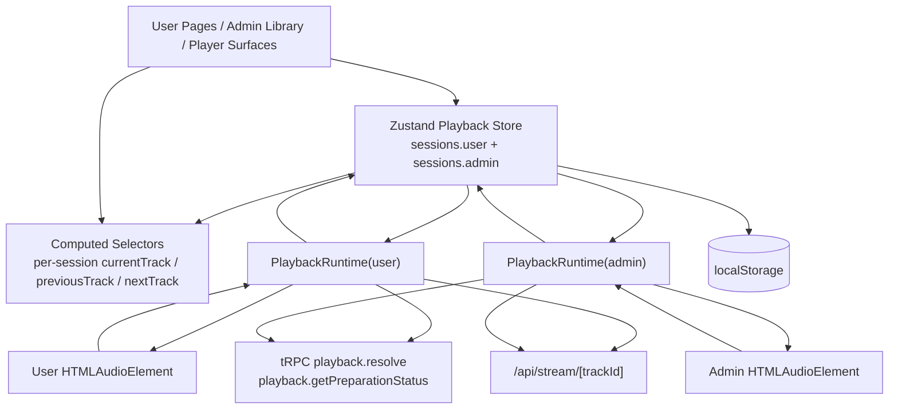
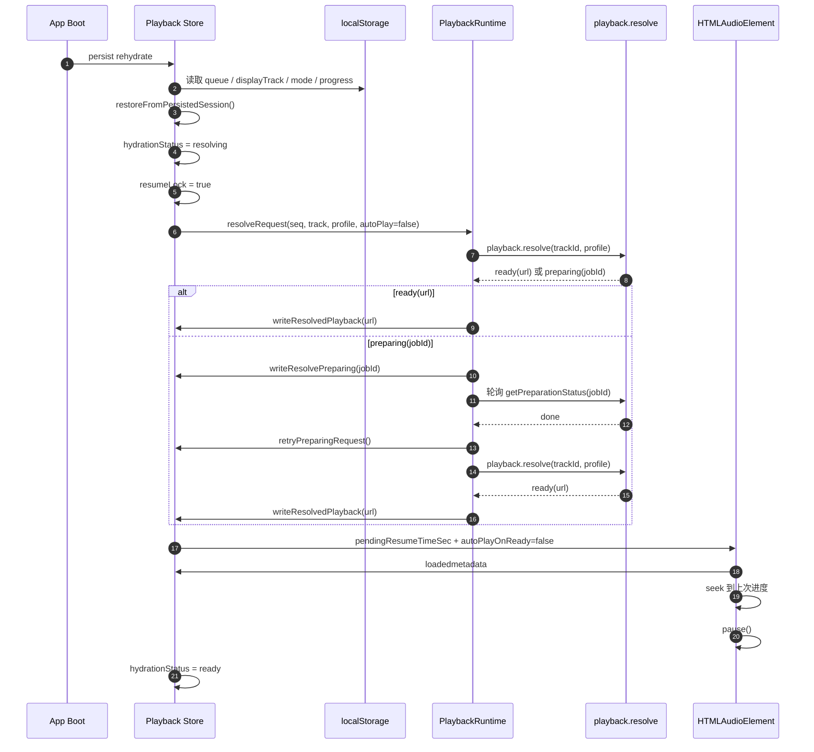
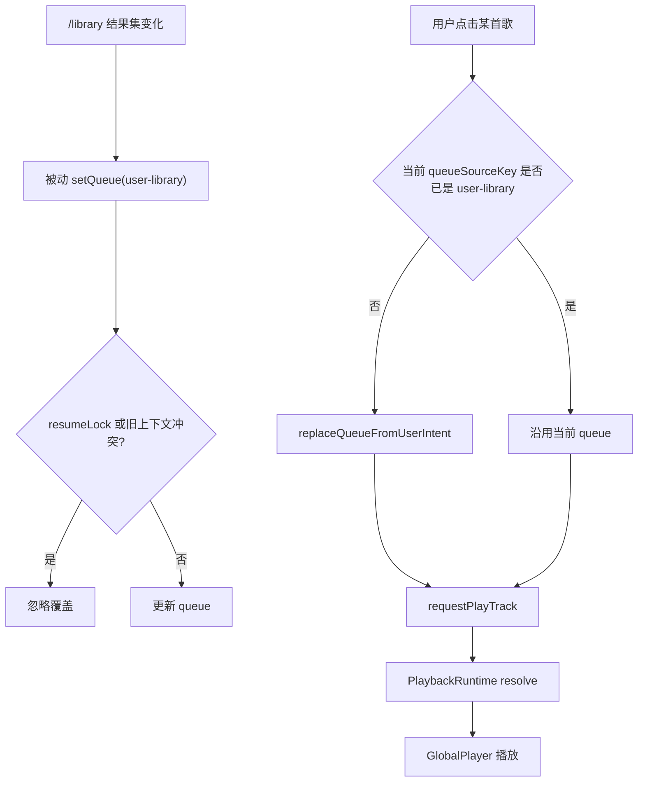
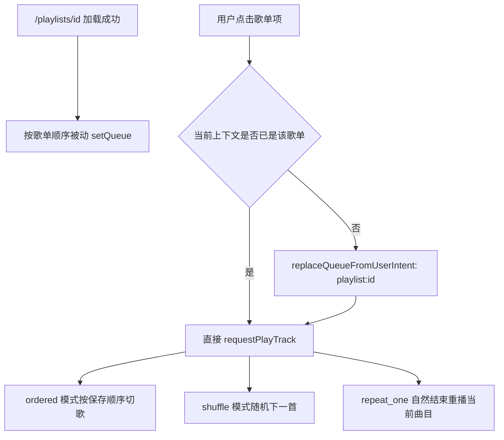
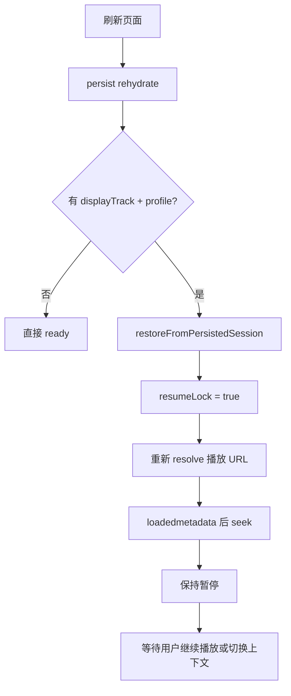
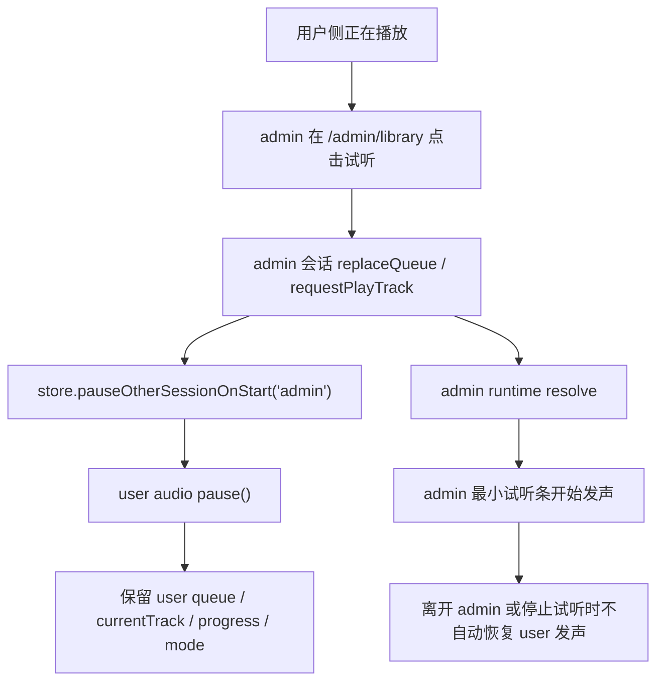
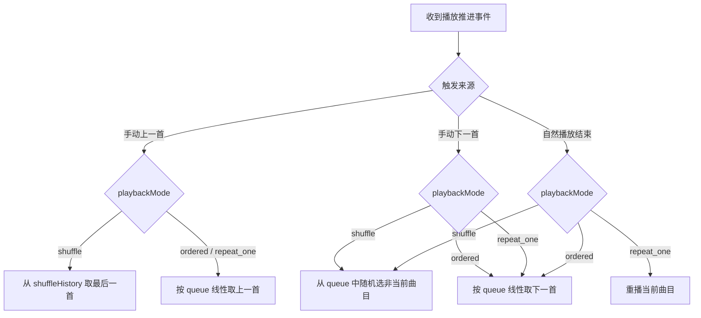

# Playback Runtime And Modes

本文档专门解释当前播放器重构后的状态分层、运行时职责和业务流转。它对应代码中的：

- [playback-store.ts](/Users/namehu/github/music-tagger/web/store/playback-store.ts)
- [playback-runtime.tsx](/Users/namehu/github/music-tagger/web/components/playback/playback-runtime.tsx)
- [global-player.tsx](/Users/namehu/github/music-tagger/web/components/playback/global-player.tsx)
- [playback-state.ts](/Users/namehu/github/music-tagger/web/lib/playback-state.ts)

## 1. 总体目标

- 让播放状态不再依附某个页面或某个 provider 实例
- 把播放拆成 `user` 持续播放会话和 `admin` 临时试听会话
- 让用户侧顺序、随机、单曲循环复用同一套 queue 语义
- 让浏览器刷新后只恢复用户侧会话，但不恢复失效的 URL / token
- 把副作用和业务状态拆开，方便调试和后续扩展

## 2. 播放状态分层图

## 3. store 与 runtime 的职责边界

| 层 | 负责内容 | 不负责内容 |
| --- | --- | --- |
| `playback-store.ts` | 在同一个 zustand 容器里持有 `sessions.user` 与 `sessions.admin`；提供按 `sessionKind` 参数化的切歌 action；用 computed 产出每个会话的派生状态 | 不直接发网络请求；不轮询 job；不自己执行动态签发 |
| `playback-runtime.tsx` | 每个会话各挂一个 runtime，监听各自的 `resolveRequest`、调用 `playback.resolve`、轮询 `getPreparationStatus`、消费对应 `audio` 事件、把结果回写 store | 不保存业务事实状态；不决定上一首/下一首算法 |
| `global-player.tsx` | 按会话渲染用户侧播放器或 admin 最小试听条，绑定对应 `audio` 元素，默认只展示必要 UI，更多信息放进详情展开层 | 不持有独立播放状态；不决定 token 恢复策略 |
| 页面组件 | 只向自己的会话注入 queue、触发当前会话点播 | 不跨会话写入对方的 queue |

## 4. localStorage 恢复链路图

只有 `user` 会话会进入这条恢复链路；`admin` 会话始终是内存态试听。

## 5. 业务流转图

### 5.1 用户从曲库点播

### 5.2 用户从歌单点播

### 5.3 浏览器刷新恢复

### 5.4 admin 试听打断用户实际发声

## 6. 模式切歌决策图

## 7. 为什么还需要 `PlaybackRuntime`

虽然业务状态已经迁到 `zustand`，但浏览器播放仍然需要常驻客户端 runtime 承接这些副作用：

- 按会话调 `playback.resolve`
- 按会话轮询 `playback.getPreparationStatus`
- 绑定真实 `audio` 元素
- 接收 `play / pause / ended / loadedmetadata / timeupdate` 事件
- 在 `pagehide` 时强制同步最新进度

所以这次不是“没有运行时组件”，而是“每个播放会话都有自己的 runtime，但 runtime 不持有业务状态”。

## 8. 当前恢复策略的边界

- 只恢复当前浏览器的 `user` 会话，不做数据库同步
- 不保存 URL / token，只保存可重建状态
- 恢复后默认暂停，不自动续播
- 页面挂载时的被动 queue 不能覆盖恢复中的旧会话
- 只有明确用户意图，才允许替换当前恢复队列
- `admin` 试听开始时会暂停 `user` 实际发声，但不会清空 `user` 歌单和进度
