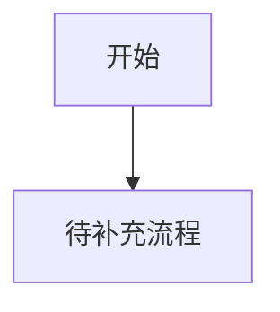

# 产品白皮书与索引

## 产品愿景与目标
- 一句话价值：
- 业务目标：
- 成功标准：

## 全局角色与权限
| 角色 | 全局权限 | 受限能力 | 说明 |
| --- | --- | --- | --- |
| 待填写 | 待填写 | 待填写 | 待填写 |

## 核心业务流程图

## 全局业务字典
| 业务名词 | 标准定义 | 英文标识 | 备注 |
| --- | --- | --- | --- |
| 待填写 | 待填写 | 待填写 | 待填写 |

## 页面路由索引
- 仅登记顶层可路由页面；页面内弹窗、抽屉和二次确认窗不进入该索引。
- `[页面名称]`: `[/page/path]` -> `对应文档: example-page.md` (页面核心功能)

## 外部依赖登记
| 依赖对象 | 类型 | 触发页面/流程 | 现状 | 处理方式 |
| --- | --- | --- | --- | --- |
| 待填写 | 待填写 | 待填写 | 待确认 | 登记缺口或展开规则 |
