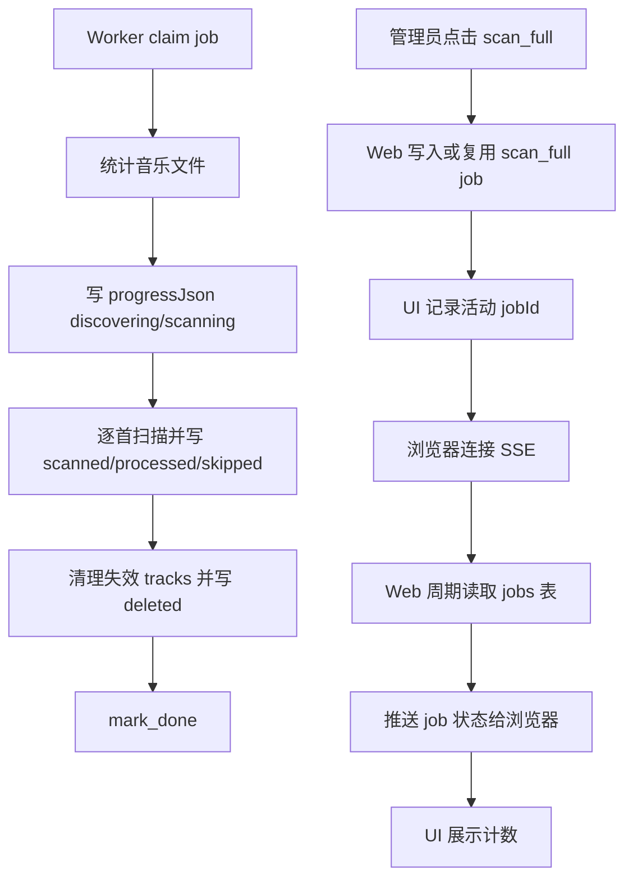

# 产品白皮书与索引

## 产品愿景与目标

- 一句话价值：管理员触发扫描后，可以看到扫描正在做什么、已经扫了多少、跳过多少，而不是只能等待一个百分比变化。
- 业务目标：
  - 为 `scan_full` 增加结构化进度明细。
  - 在 `/admin` 和 `/admin/jobs` 展示扫描计数。
  - 通过 SSE 给活动扫描任务提供更及时的状态刷新。
- 成功标准：
  - 扫描统计阶段展示“正在统计音乐文件”。
  - 扫描执行阶段展示“已扫描 N / total、跳过 N、删除 N”。
  - 扫描终态展示最终计数。
  - 只有管理员能访问任务事件流。

## 全局角色与权限

| 角色 | 全局权限 | 受限能力 | 说明 |
| --- | --- | --- | --- |
| 管理员 | 触发 `scan_full`、查看 jobs、连接任务 SSE | 无 | 本模块只服务管理端 |
| 普通用户 | 无 jobs 管理权限 | 不可访问 SSE 任务事件流 | 保持现有权限边界 |

## 核心业务流程图

## 全局业务字典

| 业务名词 | 标准定义 | 英文标识 | 备注 |
| --- | --- | --- | --- |
| 结构化任务进度 | 存在 `jobs.progressJson` 的任务运行明细 | Structured Job Progress | v1 只定义 `scan_full` |
| 扫描总数 | `scan_full` 统计到的音频文件总量 | Scan Total | 统计完成前为 `null` |
| 已扫描 | 已尝试处理的音频文件数量 | Scanned Count | 成功和跳过都会计入 |
| 已处理 | 成功写入或更新曲库索引的音频文件数量 | Processed Count | 不包含 skipped |
| 已跳过 | 因单文件错误而跳过的音频文件数量 | Skipped Count | worker 不中断整体扫描 |
| 已删除 | 清理不存在源文件后删除的 track 数量 | Deleted Count | 清理阶段后可知 |

## 页面路由索引

- `[管理首页]`: `/admin` -> `对应文档: admin-page.md`
- `[Jobs 页]`: `/admin/jobs` -> `对应文档: admin-jobs-page.md`

## 外部依赖登记

| 依赖对象 | 类型 | 触发页面/流程 | 现状 | 处理方式 |
| --- | --- | --- | --- | --- |
| `jobs` 表 | 数据库 | 所有任务观察 | 已有 `progress` | 新增 `progressJson` |
| Python worker | 后台执行器 | `scan_full` | 已写百分比 | 增加计数回写 |
| tRPC jobs router | API | jobs 查询 | 已返回 `progress` | 返回 `progressJson` |
| `/api/admin/jobs/[jobId]/events` | Route Handler | 活动任务观察 | 新增 | 管理员鉴权后推送 SSE |
