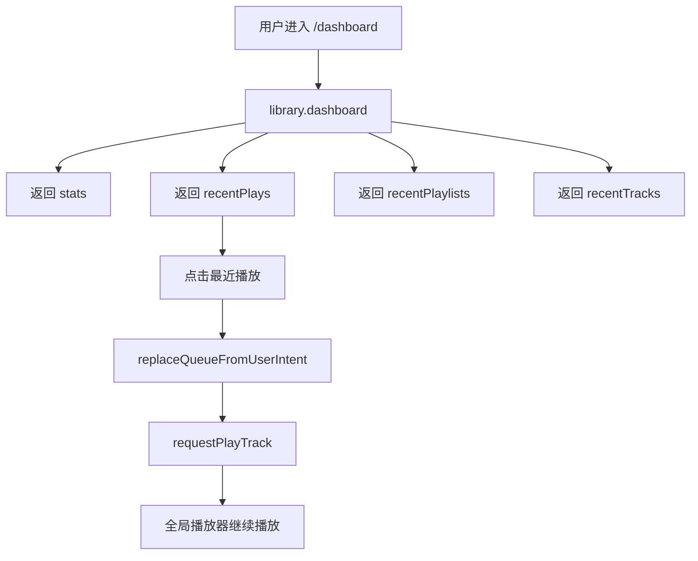

# 产品白皮书与索引

## 产品愿景与目标

- 一句话价值：让 `/dashboard` 成为用户进入音乐区后的“继续收听”入口，而不是只有跳转按钮的空壳首页。
- 业务目标：
  - 用现有事实数据把最近播放、最近更新歌单和最近更新曲目聚合到用户首页
  - 保留当前播放摘要作为首页主卡的一部分
  - 不把用户首页做成管理分析面板
- 成功标准：
  - `/dashboard` 能展示最近播放
  - `/dashboard` 能展示最近更新的歌单
  - `/dashboard` 能展示最近更新的曲目
  - 最近播放可直接开始点播，并接入全局播放器

## 全局角色与权限

| 角色 | 全局权限 | 受限能力 | 说明 |
| --- | --- | --- | --- |
| 普通用户 | 查看自己的用户首页、最近播放、最近更新歌单与最近更新曲目 | 不可进入 `/admin` | 首页只展示当前用户可见的曲库内容 |
| 管理员 | 同普通用户 | 无额外首页权限 | 在用户区内仍看到同一套用户首页 |

## 核心业务流程图

## 全局业务字典

| 业务名词 | 标准定义 | 英文标识 | 备注 |
| --- | --- | --- | --- |
| 最近播放 | 最近被点播过、且当前用户仍可见的曲目列表 | Recent Plays | 基于 `PlaybackResolveEvent` 去重聚合 |
| 最近更新的歌单 | 当前用户按 `updatedAt` 倒序排列的歌单列表 | Recently Updated Playlists | 不是“最近打开的歌单” |
| 最近更新的曲目 | 当前用户仍可见的、按 `tracks.updatedAt` 倒序排列的曲目 | Recently Updated Tracks | 只作为轻量曲库动态 |
| 继续收听 | 当前播放摘要与恢复状态的首页入口 | Continue Listening | 复用全局播放器状态 |

## 页面路由索引

- `[用户首页]`: `/dashboard` -> `对应文档: dashboard-page.md`

## 外部依赖登记

| 依赖对象 | 类型 | 触发页面/流程 | 现状 | 处理方式 |
| --- | --- | --- | --- | --- |
| `library.dashboard` | tRPC | `/dashboard` | 新增 | 聚合 stats、recent plays、recent playlists、recent tracks |
| `PlaybackResolveEvent` | Prisma model | 最近播放聚合 | 已落地 | 只作为最近点播事实，不追加 userId |
| `playlists.updatedAt` | Prisma field | 最近更新歌单 | 已落地 | 作为“最近维护”的近似事实 |
| playback store | 前端状态 | 首页最近播放点播 | 已落地 | 复用 `replaceQueueFromUserIntent` 和 `requestPlayTrack` |
