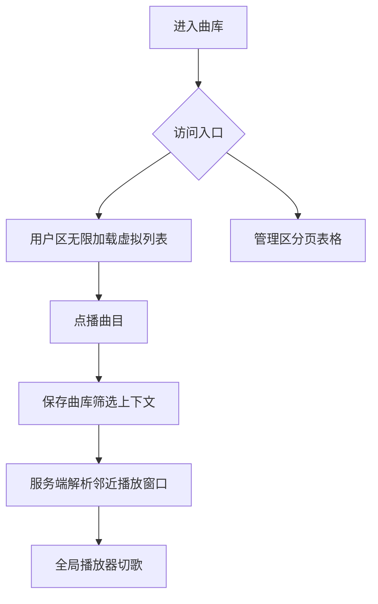

# 大曲库浏览与队列

## 产品愿景与目标
- 一句话价值：5000+ 曲目也能稳定浏览、搜索、编辑和连续播放。
- 业务目标：用户区保持播放器式浏览体验，管理区保持表格式分页管理体验。
- 成功标准：页面不一次性渲染全量曲目，播放会话不向 localStorage 写入全量曲库队列。

## 全局角色与权限
| 角色 | 全局权限 | 受限能力 | 说明 |
| --- | --- | --- | --- |
| 登录用户 | 浏览用户可见曲库、播放、我的忽略 | 不可全局忽略或编辑 | `/library` |
| 管理员 | 浏览管理曲库、编辑、全局忽略、临时试听 | admin 试听不持久化 | `/admin/library` |

## 核心业务流程图

## 全局业务字典
| 业务名词 | 标准定义 | 英文标识 | 备注 |
| --- | --- | --- | --- |
| 曲库筛选上下文 | 当前曲库播放来源、搜索词、排序、可见性和编辑过滤 | `queueContext` | 用于按需解析播放窗口 |
| 邻近播放窗口 | 当前曲目前后有限数量的曲目 | queue window | 替代全量队列入前端 state |

## 页面路由索引
- `用户曲库`: `/library` -> `library-page.md`
- `管理曲库`: `/admin/library` -> `library-page.md`

## 外部依赖登记
| 依赖对象 | 类型 | 触发页面/流程 | 现状 | 处理方式 |
| --- | --- | --- | --- | --- |
| `react-virtuoso` | 前端虚拟列表 | 用户曲库滚动 | 已安装 | 用户曲库主列表使用 |
