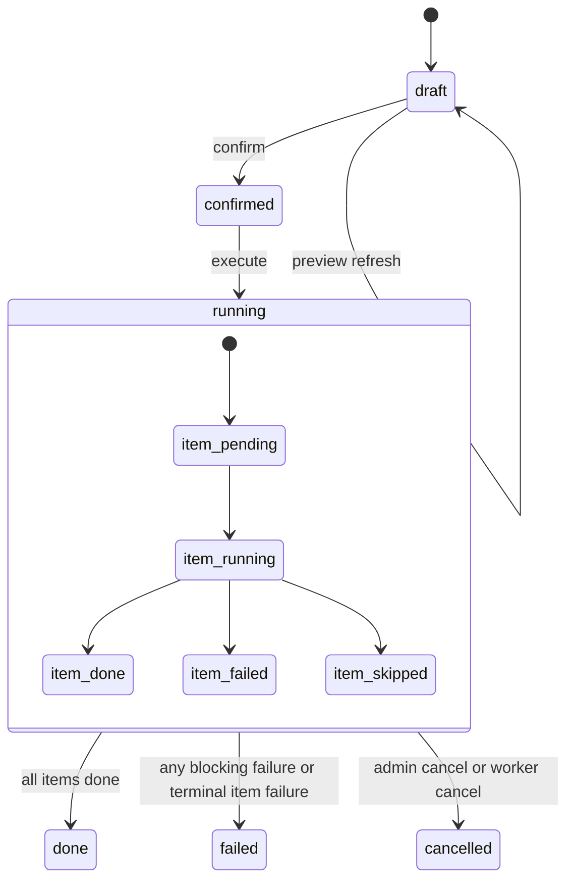

# Plan 详情页

## 模块 A：页面元数据

- **页面名称**：Plan 详情页
- **访问路由**：`/admin/plans/[planId]`
- **权限要求**：仅管理员可访问；普通用户与未登录用户不能查看计划内容。

## 模块 B：UI/布局结构

- **页面布局模式**：详情页，采用头部摘要 + 预览摘要区 + 计划项列表 + 风险与执行区块。
- **核心区块划分**：
  - [头部摘要区]：plan 基础信息、当前状态、类型、作用范围、创建人、更新时间。
  - [预览摘要区]：预览时间、item 数、warning 数、阻断性错误数。
  - [计划项列表]：按 item 展示路径 diff、标签 diff、warning、状态、错误信息。
  - [执行控制区]：`preview`、`confirm`、`execute`、刷新状态、跳转 jobs。
  - [风险提示区]：展示 preview 警告、执行失败摘要和回滚边界说明。
- **页面内从属交互**：
  - 当前实现没有单独的确认弹窗与执行弹窗，按钮直接触发对应 mutation。

## 模块 C：数据展示与字段定义

### 字段分组 1：头部摘要字段
| 字段名称 (中/英) | 数据类型 | 必填/选填 | 业务规则/约束 | 默认值 |
| --- | --- | --- | --- | --- |
| 计划 ID `id` | string | 必显 | 与路由参数一致 | 无 |
| 计划状态 `status` | enum | 必显 | `draft / confirmed / running / done / failed / cancelled` | 无 |
| 计划类型 `type` | enum | 必显 | v1 仅支持 `rename / tag_write` | 无 |
| 作用范围 `scope` | array<object> | 必显 | 展示结构化摘要，不直接暴露原始 JSON | 无 |
| 执行参数 `params` | array<object> | 必显 | confirm 前可读可编辑，confirm 后只读 | 无 |
| 创建人 `createdBy` | string | 必显 | 当前 v1 默认为管理员 | 无 |
| 最近更新时间 `updatedAt` | datetime | 必显 | 页面刷新基准 | 无 |

### 字段分组 2：预览摘要字段
| 字段名称 (中/英) | 数据类型 | 必填/选填 | 业务规则/约束 | 默认值 |
| --- | --- | --- | --- | --- |
| 计划项数量 `itemCount` | integer | 必显 | preview 后生成 | `0` |
| 警告数量 `warningCount` | integer | 必显 | preview 后生成 | `0` |
| 阻断项数量 `blockingCount` | integer | 必显 | 大于 0 时不可 execute | `0` |
| 最近预览时间 `previewedAt` | datetime | 选显 | 未 preview 时为空 | 空 |

### 字段分组 3：计划项列表列
| 字段名称 (中/英) | 数据类型 | 必填/选填 | 业务规则/约束 | 默认值 |
| --- | --- | --- | --- | --- |
| 计划项 ID `id` | string | 必显 | 唯一标识 item | 无 |
| 类型 `kind` | enum | 必显 | `rename / tag_write` | 无 |
| 曲目 `track` | string | 选显 | 允许为空，兼容未来目录级动作 | 空 |
| 路径变更 `pathDiff` | array<object> | 选显 | `rename` 时展示 `from -> to` | 空 |
| 标签差异 `tagDiff` | array<object> | 选显 | `tag_write` 时展示字段级 old/new | 空 |
| 警告 `warnings` | array<object> | 选显 | 一项可包含多个 warning | 空 |
| 执行状态 `itemStatus` | enum | 必显 | `pending / running / done / failed / skipped` | `pending` |
| 错误信息 `error` | string | 选显 | 失败时展示摘要 | 空 |

### 字段分组 4：执行反馈字段
| 字段名称 (中/英) | 数据类型 | 必填/选填 | 业务规则/约束 | 默认值 |
| --- | --- | --- | --- | --- |
| 执行 jobId `jobId` | string | 选显 | execute 成功后产生 | 空 |
| 执行状态 `jobStatus` | string | 选显 | 当前直接读取关联 job 的 `status` | 空 |
| 错误摘要 `errorMessage` | string | 选显 | plan 或关联 job 失败时展示摘要 | 空 |
| 回滚说明 `rollbackPolicy` | string | 必显 | 固定提示“尽力回滚，不承诺强一致” | 固定值 |

## 模块 D：交互与状态流转

### 操作 1：执行 preview
- **触发事件**：点击“生成预览”或“刷新预览”按钮。
- **前置校验**：
  - 当前 plan 必须存在
  - 当前状态必须允许 preview，默认允许在 `draft` 阶段重复 preview
  - `scope` 与 `params` 必须可被后端解析
- **流转结果**：调用 `plans.preview`，重建或刷新 `plan_items` 与 warning 聚合结果。
- **成功结果**：
  - 生成或刷新 `plan_items`
  - 更新预览摘要
  - 在列表中展示 warnings 与 diff
- **失败结果**：
  - 页面显示错误提示
  - 保留上一次成功的 preview 快照
  - 若为阻断性错误，将 `previewState` 标记为 `blocked`

### 操作 2：确认 Plan
- **触发事件**：点击“确认 Plan”按钮。
- **前置校验**：
  - 当前状态必须为 `draft`
  - 必须至少有一轮成功 preview
  - 不允许存在阻断性错误
- **流转结果**：调用 `plans.confirm`，将 plan 冻结为 `confirmed`。
- **成功结果**：
  - plan 状态更新为 `confirmed`
  - `scope` 与 `params` 进入只读状态
  - 页面提示已可执行
- **失败结果**：
  - 保留当前页面状态
  - 展示不能 confirm 的具体原因

### 操作 3：执行 Plan
- **触发事件**：点击“执行 Plan”按钮。
- **前置校验**：
  - 当前状态必须为 `confirmed`
  - 不存在活跃中的同一 `plan_execute` job
  - preview 快照仍然有效
- **流转结果**：调用 `plans.execute` 创建 `plan_execute` job，并将页面状态切换到运行态。
- **成功结果**：
  - 创建 `plan_execute` job
  - 页面状态进入 `running`
  - 展示 `jobId` 并提供跳转 jobs 页面入口
- **失败结果**：
  - 展示服务端错误
  - 不重复创建同一执行 job

### 操作 4：筛选计划项
- **触发事件**：选择 `itemStatus` 筛选条件。
- **前置校验**：plan 已存在。
- **流转结果**：仅刷新计划项列表区域，不重置头部摘要。
- **成功结果**：仅刷新计划项区域。
- **失败结果**：保持当前列表并提示失败。

### 操作 5：刷新执行状态
- **触发事件**：页面自动轮询或点击刷新按钮。
- **前置校验**：当 plan 状态为 `running` 时启用自动轮询。
- **流转结果**：重新获取 plan 与 plan item 状态，并同步执行进度。
- **成功结果**：更新 plan 状态、item 状态、进度与失败摘要。
- **失败结果**：提示刷新失败，但不清空当前视图。

### 页面状态与异常
- **加载中**：头部摘要和计划项列表分别展示 loading。
- **无数据**：plan 不存在时展示 404 风格状态。
- **网络错误**：展示错误说明与刷新按钮。
- **无权限**：跳转登录或展示管理员权限提示。
- **重复提交**：confirm / execute 按钮带 loading，完成前禁止再次点击。
- **分页逻辑**：v1 可先不分页，按 plan 详情完整展示 item；超大计划后续再补分页。
- **搜索逻辑**：当前不提供全文搜索；仅支持按 item 状态筛选。
- **排序逻辑**：当前按生成顺序展示 item。

## 模块 E：复杂业务逻辑图

