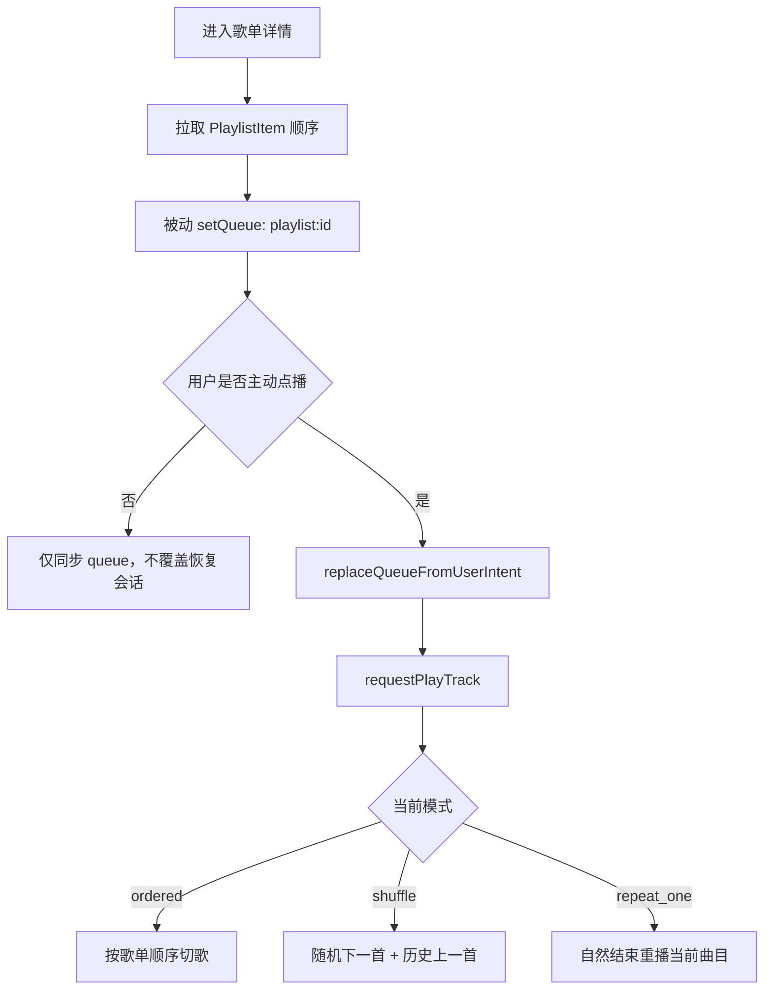

# 歌单详情页

## 模块 A：页面元数据

- **页面名称**：歌单详情页
- **访问路由**：`/playlists/[playlistId]`
- **权限要求**：歌单所有者可访问并点播自己的歌单队列。

## 模块 B：UI/布局结构

- **页面布局模式**：双栏详情页 + 全局播放器底栏。
- **核心区块划分**：
  - [歌单曲目区]：展示当前歌单项与播放状态。
  - [加歌候选区]：搜索并加入更多曲目。
  - [全局播放器区]：全局控制模式切换、上一首/下一首和恢复状态。
- **页面内从属交互**：
  - [歌单 queue 同步]：歌单详情页把当前歌单顺序作为 queue 注入 store。
  - [歌单点播]：用户主动播放时，可把当前上下文明确切换到该歌单。

## 模块 C：数据展示与字段定义

### 字段分组 1：歌单播放相关字段
| 字段名称 (中/英) | 数据类型 | 必填/选填 | 业务规则/约束 | 默认值 |
| --- | --- | --- | --- | --- |
| 队列来源 `queueSourceKey` | string | 必显 | 形如 `playlist:<playlistId>` | 无 |
| 当前活动曲目 `activeTrackId` | string | 选显 | 用于标记正在播放或已选中的歌单项 | `null` |
| 播放模式 `playbackMode` | enum | 必显 | 影响全局上一首/下一首规则 | `ordered` |
| 随机历史 `shuffleHistory` | array<object> | 选显 | 仅在 `shuffle` 模式下使用 | 空 |

## 模块 D：交互与状态流转

### 操作 1：进入歌单详情并注入 queue
- **触发事件**：进入 `/playlists/[playlistId]`。
- **前置校验**：歌单存在且属于当前用户。
- **流转结果**：加载歌单详情后，以保存顺序执行被动 `setQueue`。
- **成功结果**：当前歌单成为可供顺序或随机切歌的候选 queue。
- **失败结果**：若恢复锁仍在，则当前歌单 queue 不会覆盖恢复会话。

### 操作 2：用户在歌单中点播
- **触发事件**：点击歌单项播放按钮。
- **前置校验**：歌单项存在。
- **流转结果**：若当前 queue 来源不是该歌单，则先 `replaceQueueFromUserIntent`，再 `requestPlayTrack`。
- **成功结果**：当前歌单成为事实播放上下文，`ordered` 模式按歌单保存顺序切歌。
- **失败结果**：展示播放失败或转码失败提示。

### 操作 3：切换模式后继续在歌单上下文切歌
- **触发事件**：点击底部模式按钮，或自然播放结束。
- **前置校验**：当前歌单 queue 仍存在。
- **流转结果**：
  - `ordered`：按歌单顺序切换
  - `shuffle`：随机选下一首，上一首回放最近历史
  - `repeat_one`：自然结束后重播当前曲目
- **成功结果**：全局播放器按当前模式延续歌单上下文。
- **失败结果**：保留当前曲目并展示错误提示。

### 页面状态与异常
- **加载中**：歌单详情区和加歌区显示 loading。
- **无数据**：空歌单时提示从右侧加歌。
- **网络错误**：显示错误提示。
- **无权限**：非拥有者不可进入。
- **重复提交**：点播中或准备中的按钮显示 busy。
- **分页逻辑**：v1 不分页。
- **搜索逻辑**：加歌区复用既有搜索行为。
- **排序逻辑**：歌单项按保存顺序展示。

## 模块 E：复杂业务逻辑图

