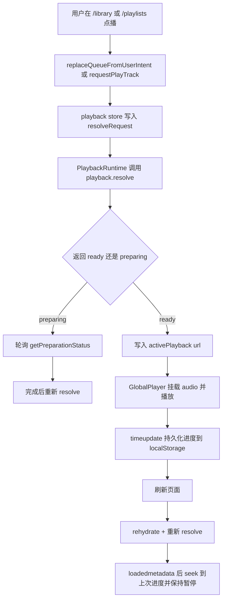

# 产品白皮书与索引

## 产品愿景与目标

- 一句话价值：让全局播放器在用户区和管理区之间稳定连续地播放，并提供可理解、可恢复的播放模式。
- 业务目标：
  - 用 `zustand` 替代旧的 React Context 播放状态持有方式
  - 让顺序、随机、单曲循环成为同一套全局队列规则
  - 让浏览器刷新后能恢复到“可继续播放”的暂停状态
- 成功标准：
  - `/library` 与 `/playlists/[playlistId]` 点播都接入同一全局队列
  - 底部播放器可切换 `ordered / shuffle / repeat_one`
  - 浏览器刷新后可恢复当前队列、曲目、模式和进度，并重新动态签发播放 URL
  - 恢复中的会话不会被页面挂载时的被动 queue 同步覆盖

## 全局角色与权限

| 角色 | 全局权限 | 受限能力 | 说明 |
| --- | --- | --- | --- |
| 普通用户 | 使用全局播放器、切换播放模式、恢复本地浏览器播放会话 | 不可使用管理员路由 | 播放模式不区分角色 |
| 管理员 | 同普通用户，并可在 `/admin` 内继续使用同一全局播放器 | 无额外播放权限 | 管理员也复用相同播放 store |

## 核心业务流程图

## 全局业务字典

| 业务名词 | 标准定义 | 英文标识 | 备注 |
| --- | --- | --- | --- |
| 播放 store | 浏览器内唯一的全局播放状态源 | Playback Store | 基于 `zustand` + computed |
| 播放运行时 | 承载副作用、轮询和 `audio` 事件的客户端运行时组件 | Playback Runtime | 不持有业务状态 |
| 恢复锁 | 恢复过程中阻止页面被动 queue 同步覆盖当前会话的锁 | Resume Lock | 直到明确用户意图替换 queue 才释放 |
| 被动 queue 同步 | 页面挂载时把当前列表注入全局 queue 的行为 | Passive Queue Sync | 例如 `/library`、`/playlists/[playlistId]` 的初次 effect |
| 明确用户意图替换 | 用户主动切换播放上下文的行为 | User-Intent Queue Replace | 例如从新的歌单或曲库重新点播 |
| 单曲循环 | 只在自然播放结束时重播当前曲目 | Repeat One | 手动上一首/下一首不受限制 |

## 页面路由索引

- `[用户首页]`: `/dashboard` -> `对应文档: dashboard-page.md`
- `[用户曲库页]`: `/library` -> `对应文档: library-page.md`
- `[歌单详情页]`: `/playlists/[playlistId]` -> `对应文档: playlist-detail-page.md`

## 外部依赖登记

| 依赖对象 | 类型 | 触发页面/流程 | 现状 | 处理方式 |
| --- | --- | --- | --- | --- |
| `playback.resolve` | tRPC | 点播、切歌、刷新恢复 | 已落地 | 继续作为动态签发播放 URL 的唯一入口 |
| `playback.getPreparationStatus` | tRPC | `mp3_192` 准备中轮询 | 已落地 | 由 `PlaybackRuntime` 统一轮询 |
| `/api/stream/[trackId]` | Route Handler | 真正输出音频字节流 | 已落地 | 继续承接 `Range` 和 token 校验 |
| `localStorage` | 浏览器存储 | 刷新恢复 | 新增依赖 | 仅持久化可重建状态，不保存 URL 或 token |
