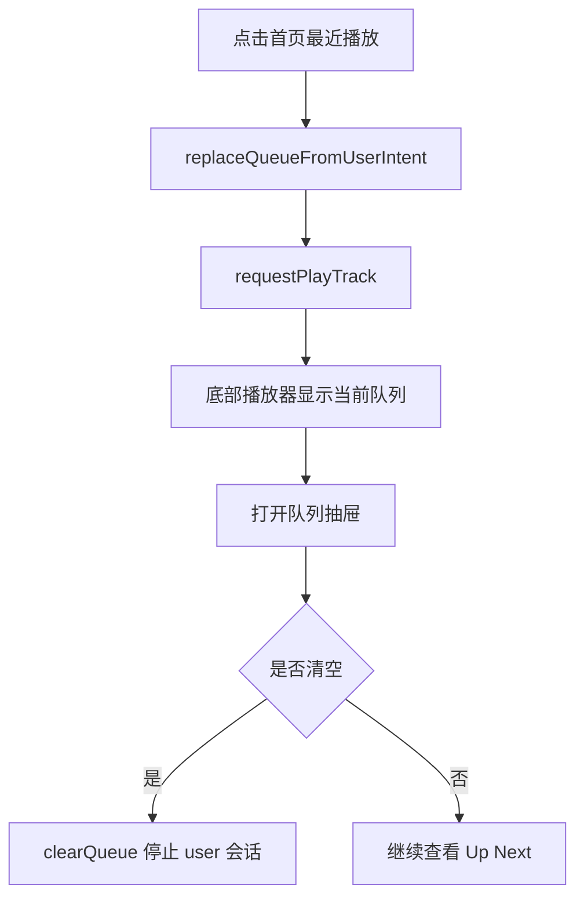

# 用户首页

## 模块 A：页面元数据

- **页面名称**：用户首页
- **访问路由**：`/dashboard`
- **权限要求**：所有已登录用户可访问。

## 模块 B：UI/布局结构

- **页面布局模式**：首页摘要卡 + 底部播放器。
- **核心区块划分**：
  - [继续收听摘要]：显示当前正式会话概况。
  - [最近播放区]：允许用户从最近播放切回用户正式队列。
  - [底部播放器]：打开队列抽屉查看当前正式队列。
- **页面内从属交互**：
  - [队列抽屉]：由底部播放器详情入口打开，承载当前队列和 Up Next。

## 模块 C：数据展示与字段定义

### 字段分组 1：当前会话摘要
| 字段名称 (中/英) | 数据类型 | 必填/选填 | 业务规则/约束 | 默认值 |
| --- | --- | --- | --- | --- |
| 当前曲目 `activeTrackId` | string | 选显 | 没有正式队列时为空 | `null` |
| 当前队列来源 `queueSourceKey` | string | 选显 | 仅做摘要展示 | `null` |
| 队列长度 `queueSize` | number | 必显 | 由 user 会话 queue 长度计算 | `0` |

### 字段分组 2：队列抽屉关键字段
| 字段名称 (中/英) | 数据类型 | 必填/选填 | 业务规则/约束 | 默认值 |
| --- | --- | --- | --- | --- |
| Up Next 第一首 `nextTrack` | object | 选显 | 当前曲目后的第一首 | `null` |
| 剩余队列 `remainingQueue` | array | 必显 | 当前曲目后续项按真实顺序展示 | `[]` |
| 清空队列 `clearQueue` | action | 必显 | 仅清空 user 会话 | 无 |

## 模块 D：交互与状态流转

### 操作 1：从首页最近播放切回正式队列
- **触发事件**：点击最近播放卡片的播放按钮。
- **前置校验**：曲目存在，用户已登录。
- **流转结果**：调用 `replaceQueueFromUserIntent` 写入 `dashboard:recent-plays`，再点播目标曲目。
- **成功结果**：底部播放器与队列抽屉展示该首页队列。
- **失败结果**：展示播放或转码失败提示。

### 操作 2：打开队列抽屉查看 Up Next
- **触发事件**：点击底部播放器的队列入口。
- **前置校验**：底部播放器可见。
- **流转结果**：读取 user 会话的 queue、activeTrackId 与 nextTrack。
- **成功结果**：抽屉展示当前曲目、下一首和剩余队列。
- **失败结果**：若队列为空则展示空状态。

### 操作 3：清空当前队列
- **触发事件**：在抽屉中点击“清空队列”。
- **前置校验**：当前存在用户正式队列。
- **流转结果**：清空 user 队列并停止 user 会话发声。
- **成功结果**：播放器回到无队列状态。
- **失败结果**：保持原队列并提示错误。

### 页面状态与异常
- **加载中**：首页查询与底部播放器独立加载。
- **无数据**：无当前队列时，抽屉显示空状态。
- **网络错误**：最近播放查询失败时不影响底部队列抽屉。
- **无权限**：未登录时跳转 `/sign-in`。
- **重复提交**：清空队列提交中按钮 disabled。
- **分页逻辑**：v1 不做分页。
- **搜索逻辑**：首页不承担搜索。
- **排序逻辑**：队列按真实播放顺序展示，不允许重排。

## 模块 E：复杂业务逻辑图

