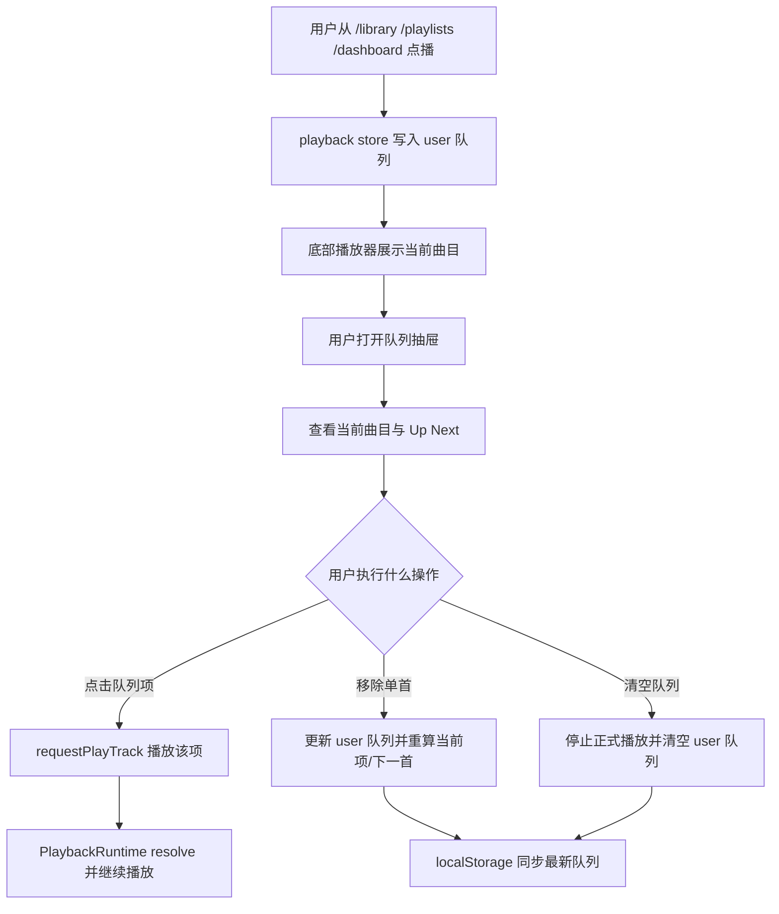

# 产品白皮书与索引

## 产品愿景与目标

- 一句话价值：让用户真正看见“现在在播什么、接下来播什么”，并能在不离开播放器的情况下直接调整当前队列。
- 业务目标：
  - 为用户侧正式播放会话补一个明确的 `Up Next / 当前队列` 抽屉
  - 让当前曲目、下一首、队列来源、剩余队列可读可操作
  - 在不破坏现有恢复逻辑的前提下，支持单首移除、清空队列、点击任意项立即播放
- 成功标准：
  - 用户侧播放器可打开队列抽屉并看到当前正式队列
  - 当前播放曲目会高亮，下一首有明确提示
  - 支持从当前队列中移除某一首和清空整个队列
  - 队列编辑后仍能正确持久化并在刷新后恢复

## 全局角色与权限

| 角色 | 全局权限 | 受限能力 | 说明 |
| --- | --- | --- | --- |
| 普通用户 | 使用用户正式队列、查看 Up Next、调整自己的当前队列 | 不可操作 admin 试听会话 | 队列面板只属于用户正式会话 |
| 管理员 | 在用户区同样可使用正式队列面板 | `/admin` 试听不会展示用户正式队列面板 | 管理台试听继续保持工具化 |

## 核心业务流程图

## 全局业务字典

| 业务名词 | 标准定义 | 英文标识 | 备注 |
| --- | --- | --- | --- |
| 用户正式队列 | 用户区真正用于连续播放的当前队列 | User Playback Queue | 与 admin 试听会话隔离 |
| Up Next | 当前曲目之后按真实播放顺序即将播放的项目集合 | Up Next | v1 只读展示，不做“下一首插队” |
| 队列抽屉 | 由底部播放器打开的用户侧底部抽屉 | Queue Drawer | 不单独成为顶层路由 |
| 队列清空 | 清空当前正式队列并停止正式播放 | Clear Queue | 只作用于 user 会话 |

## 页面路由索引

- `[用户首页]`: `/dashboard` -> `对应文档: dashboard-page.md`
- `[用户曲库页]`: `/library` -> `对应文档: library-page.md`
- `[歌单详情页]`: `/playlists/[playlistId]` -> `对应文档: playlist-detail-page.md`

## 外部依赖登记

| 依赖对象 | 类型 | 触发页面/流程 | 现状 | 处理方式 |
| --- | --- | --- | --- | --- |
| `playback-store` | 前端状态 | 队列展示、移除、清空、跳播 | 已落地 | 扩展 user 会话队列动作与 selector |
| `PlaybackRuntime` | 运行时 | 点击队列项后的实际播放 | 已落地 | 继续处理 resolve、转码轮询和 audio 事件 |
| `localStorage` | 浏览器存储 | 队列编辑后的刷新恢复 | 已落地 | 队列编辑后继续持久化 user 会话 |
| `playback.resolve` | tRPC | 队列内点击播放 | 已落地 | 不新增后端 contract，继续复用 |
