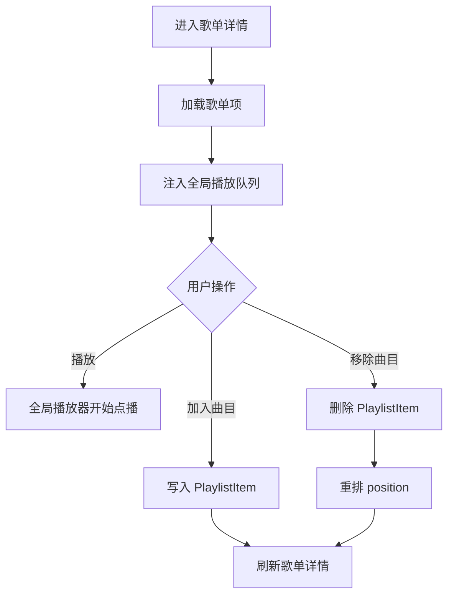

# 歌单详情页

## 模块 A：页面元数据

- **页面名称**：歌单详情页
- **访问路由**：`/playlists/[playlistId]`
- **权限要求**：所有已登录用户可访问，但只可查看和修改自己的歌单。

## 模块 B：UI/布局结构

- **页面布局模式**：双栏详情页，左侧歌单项列表，右侧曲库搜索与加歌区。
- **核心区块划分**：
  - [歌单项区]：展示当前歌单曲目、顺序、播放状态、移除按钮。
  - [加歌区]：搜索曲库并加入当前歌单。
- **页面内从属交互**：
  - 当前无弹窗；移除与加入直接在页内完成。

## 模块 C：数据展示与字段定义

### 字段分组 1：歌单项字段
| 字段名称 (中/英) | 数据类型 | 必填/选填 | 业务规则/约束 | 默认值 |
| --- | --- | --- | --- | --- |
| 歌单项 ID `itemId` | string | 必显 | 用于移除操作 | 无 |
| 顺序 `position` | integer | 必显 | 前端展示为从 1 开始 | `0` |
| 曲目标题 `title` | string | 必显 | 优先显示 override 后标题 | 无 |
| 艺人 `artist` | string | 必显 | 无值时显示占位 | 无 |
| 专辑 `album` | string | 选显 | 无值时显示占位 | 空 |

### 字段分组 2：加歌搜索字段
| 字段名称 (中/英) | 数据类型 | 必填/选填 | 业务规则/约束 | 默认值 |
| --- | --- | --- | --- | --- |
| 关键字 `q` | string | 选填 | 搜索标题、艺人、专辑、文件名 | 空 |
| 候选曲目 `tracks` | array<object> | 必显 | 来自 `tracks.list` | 空 |

## 模块 D：交互与状态流转

### 操作 1：加载歌单详情
- **触发事件**：进入 `/playlists/[playlistId]`。
- **前置校验**：歌单存在且属于当前用户。
- **流转结果**：调用 `playlists.get`。
- **成功结果**：展示歌单项，并把当前歌单顺序注入全局播放队列。
- **失败结果**：展示“歌单不存在”或加载失败提示。

### 操作 2：从歌单移除曲目
- **触发事件**：点击“移除”。
- **前置校验**：当前用户拥有该歌单项。
- **流转结果**：调用 `playlists.removeTrack`，并重新压紧 `position`。
- **成功结果**：刷新歌单项列表。
- **失败结果**：展示错误提示。

### 操作 3：从曲库加入曲目或开始点播
- **触发事件**：点击“加入”或曲目播放按钮。
- **前置校验**：歌单存在；曲目存在。
- **流转结果**：加入时调用 `playlists.addTrack`；播放时触发 `playback.resolve`。
- **成功结果**：加入后刷新歌单列表；播放后全局播放器开始工作。
- **失败结果**：展示加歌或播放失败提示。

### 页面状态与异常
- **加载中**：歌单详情和候选曲目列表显示 loading。
- **无数据**：空歌单时提示从右侧加入曲目。
- **网络错误**：显示错误提示。
- **无权限**：未登录时跳转 `/sign-in`，非拥有者返回 404 风格错误。
- **重复提交**：加入/移除按钮进入 loading。
- **分页逻辑**：v1 不分页。
- **搜索逻辑**：加歌区使用 `tracks.list` 搜索。
- **排序逻辑**：歌单项按 `position ASC`，候选曲目按标题排序。

## 模块 E：复杂业务逻辑图

