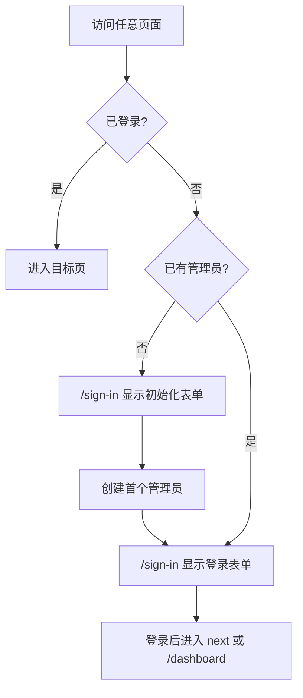

# Setup / Auth

## 产品愿景与目标
- 一句话价值：首次初始化和日常登录使用同一个入口。
- 业务目标：未登录访问任意页面时，系统自动判断是否需要初始化或登录。
- 成功标准：没有独立 `/setup` 页面；未初始化时 `/sign-in` 显示初始化表单；初始化后 `/sign-in` 显示登录表单。

## 全局角色与权限
| 角色 | 全局权限 | 受限能力 | 说明 |
| --- | --- | --- | --- |
| 未登录访客 | 访问 `/sign-in` | 不能进入业务页面 | proxy 统一拦截 |
| 已登录用户 | 访问用户区 | 非管理员不能访问 `/admin` | admin layout 二次校验 |
| 管理员 | 访问用户区和管理区 | 无 | 首个账号由初始化流程设为 admin |

## 核心业务流程图

## 页面路由索引
- `[登录与初始化页]`: `/sign-in` -> `sign-in-page.md`

## 外部依赖登记
| 依赖对象 | 类型 | 触发页面/流程 | 现状 | 处理方式 |
| --- | --- | --- | --- | --- |
| better-auth | 账号/session | 登录、创建账号 | 已接入 | 继续复用 |
| setup tRPC router | API | 初始化状态与创建管理员 | 已接入 | 继续复用 |
