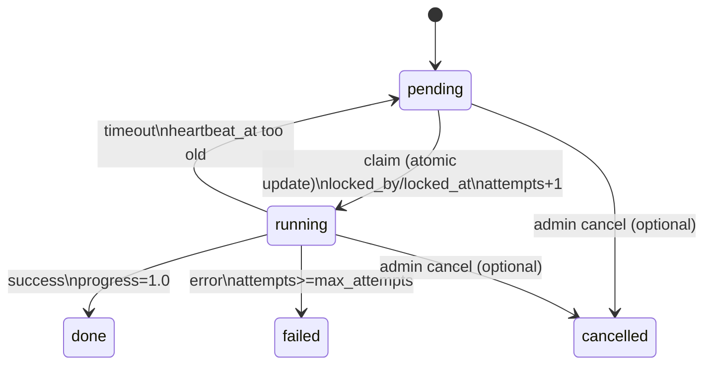
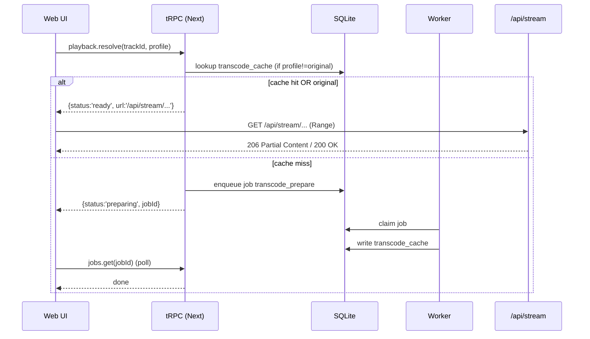

# 本地音乐管理工具（M0）Implementation Plan

> **For agentic workers:** REQUIRED SUB-SKILL: Use superpowers:subagent-driven-development (recommended) or superpowers:executing-plans to implement this plan task-by-task. Steps use checkbox (`- [ ]`) syntax for tracking.

**Goal:** 跑通“工程骨架 + Prisma(SQLite) + better-auth + /setup 初始化管理员 + tRPC 控制面 + Jobs 队列最小实现 + 扫描全量（占位实现）+ 库浏览/搜索（先不做 FTS）”的端到端闭环。

**Architecture:** Next.js 16 作为控制面（tRPC/鉴权/页面），SQLite 作为唯一持久化；Python worker 轮询 jobs 表执行后台任务。流媒体 `/api/stream/*` 与 better-auth `/api/auth/*` 作为协议层例外路由。

**Tech Stack:** Next.js 16 (App Router), tRPC v11, Prisma ORM (SQLite), better-auth, TailwindCSS, Python 3.11+, sqlite3, ffmpeg/ffprobe, pnpm (workspace)

---

## 0) 文件结构（本计划会创建/修改）

**仓库根目录（你当前选择的文件夹）**
- 保留：`docker-compose.yml`, `schema.sql`, `本地音乐管理工具-需求与架构设计 (1).md`
- 新增：
  - `docs/superpowers/specs/2026-04-01-local-music-manager-design.md`（已存在）
  - `docs/superpowers/plans/2026-04-01-local-music-manager-m0-implementation-plan.md`（本文件）
  - `web/`（Next.js 16 应用）
  - `worker/`（Python worker）

**web/**
- Create:
  - `web/package.json`（create-next-app 生成）
  - `web/src/app/**`（页面与 route handlers）
  - `web/src/server/trpc/**`（tRPC server）
  - `web/src/lib/**`（prisma/auth/utils）
  - `web/prisma/schema.prisma`
  - `web/prisma/migrations/**`
  - `web/.env.example`
- Modify:
  - `web/src/app/layout.tsx`（挂载 tRPC provider）
  - `web/src/app/page.tsx`（首页占位）

**worker/**
- Create:
  - `worker/pyproject.toml`（uv 或 poetry；本计划用最轻依赖，不强制）
  - `worker/worker.py`（主入口）
  - `worker/jobs.py`（领取/心跳/更新状态）
  - `worker/scanner.py`（扫描占位：写入少量 Track 样例）
  - `worker/README.md`（如何本地运行）

---

## Task 1: 预检环境（Node/Python/ffmpeg/SQLite）

**Files:** 无  

- [ ] **Step 1: 检查 Node 版本**

Run（在仓库根目录）：
```bash
node -v
```
Expected：输出版本号，且 **>= v20.9.0**（Next 16 要求 Node 20.9+）。

- [ ] **Step 2: 确认 pnpm 可用（建议通过 corepack）**

Run：
```bash
corepack enable
corepack prepare pnpm@10.33.0 --activate
pnpm -v
```
Expected：输出 pnpm 版本号（无需固定）。

- [ ] **Step 3: 检查 Python 版本**

Run：
```bash
python3 --version
```
Expected：输出版本号，建议 >= 3.11。

- [ ] **Step 4: 检查 ffmpeg/ffprobe**

Run：
```bash
ffmpeg -version
ffprobe -version
```
Expected：两条命令均返回版本信息（exit code 0）。

---

## Task 2: 补齐 3 张“最小高价值”Mermaid 图到设计文档

**Files:**
- Modify: `docs/superpowers/specs/2026-04-01-local-music-manager-design.md`

- [ ] **Step 1: 在设计文档末尾追加 “附录：流程图”**

在文档最后追加以下内容（原样粘贴）：

```markdown
## 附录：关键流程图（Mermaid）

### A1. Jobs 状态机（M0）



### A2. 播放解析与流媒体（M1 之前的约定）



### A3. /setup 初始化首个管理员（M0）

```mermaid
flowchart TD
  A[访问 /setup] --> B{DB 是否存在 admin 用户?}
  B -- 是 --> C[返回 404 或跳转首页]
  B -- 否 --> D[渲染创建管理员表单]
  D --> E[提交: 创建用户 + role=admin]
  E --> F[写入 DB]
  F --> G[跳转到 / (或 /dashboard)]
```
```

- [ ] **Step 2: 自查渲染效果**

Expected：Markdown 中 Mermaid 代码块完整闭合；无嵌套反引号错误。

---

## Task 3: 初始化 pnpm workspace（根目录）

**Files:**
- Create: `pnpm-workspace.yaml`
- Create: `package.json`

- [ ] **Step 1: 创建 pnpm-workspace.yaml**

Create `pnpm-workspace.yaml`（仓库根目录）：
```yaml
packages:
  - "web"
  - "worker"
```

- [ ] **Step 2: 创建根 package.json（workspace 元信息 + 常用脚本）**

Create `package.json`（仓库根目录）：
```json
{
  "name": "local-music-manager",
  "private": true,
  "packageManager": "pnpm@10.33.0",
  "scripts": {
    "dev:web": "pnpm -C web dev",
    "build:web": "pnpm -C web build",
    "start:web": "pnpm -C web start",
    "prisma:studio": "pnpm -C web prisma studio",
    "prisma:migrate": "pnpm -C web prisma migrate dev",
    "lint:web": "pnpm -C web lint"
  }
}
```

- [ ] **Step 3: 验证 workspace 生效**

Run（在仓库根目录）：
```bash
pnpm -v
```
Expected：输出 pnpm 版本号；且后续可用 `pnpm -C web ...` 直接操作子项目。

---

## Task 4: 创建 Next.js 16 工程（web/）

**Files:**
- Create: `web/**`（大量由脚手架生成）

- [ ] **Step 1: 使用 create-next-app 创建应用目录**

Run（在仓库根目录）：
```bash
pnpm create next-app@latest web --ts --eslint --tailwind --src-dir --app --turbopack
```
Expected：创建 `web/`，并提示 “Success! Created web at ...”。

- [ ] **Step 2: 启动开发服务器验证脚手架可跑**

Run：
```bash
pnpm -C web dev
```
Expected：终端出现 `Local: http://localhost:3000`，浏览器可打开默认首页。

停止：`Ctrl+C`。

---

## Task 5: 在 web/ 中初始化 Prisma（SQLite）

**Files:**
- Create: `web/prisma/schema.prisma`
- Create: `web/src/lib/prisma.ts`
- Create: `web/.env.example`
- Modify: `web/.env`（本地开发使用）

- [ ] **Step 1: 安装 Prisma 依赖**

Run：
```bash
pnpm -C web add -D prisma
pnpm -C web add @prisma/client
```
Expected：安装成功（exit code 0）。

- [ ] **Step 2: 初始化 Prisma**

Run：
```bash
pnpm -C web exec prisma init
```
Expected：生成 `prisma/schema.prisma` 与 `.env`（若已存在则更新提示）。

- [ ] **Step 3: 配置本地开发 DATABASE_URL（SQLite 文件）**

把 `web/.env` 中的 `DATABASE_URL` 改为：
```env
DATABASE_URL="file:./dev.db"
```

并新增 `web/.env.example`（用于文档化环境变量）：
```env
DATABASE_URL="file:./dev.db"
BETTER_AUTH_SECRET="change-me"
BETTER_AUTH_URL="http://localhost:3000"
```

- [ ] **Step 4: 写入 Prisma schema（Better Auth + 业务最小表）**

将 `web/prisma/schema.prisma` 替换为以下内容：

```prisma
generator client {
  provider = "prisma-client-js"
}

datasource db {
  provider = "sqlite"
}

enum UserRole {
  admin
  user
}

// ===== Better Auth models (based on Prisma guide) =====
model User {
  id            String    @id
  name          String
  email         String
  emailVerified Boolean
  image         String?
  createdAt     DateTime
  updatedAt     DateTime
  sessions      Session[]
  accounts      Account[]

  role          UserRole  @default(user)

  @@unique([email])
  @@map("user")
}

model Session {
  id        String   @id
  expiresAt DateTime
  token     String
  createdAt DateTime
  updatedAt DateTime
  ipAddress String?
  userAgent String?
  userId    String
  user      User     @relation(fields: [userId], references: [id], onDelete: Cascade)

  @@unique([token])
  @@map("session")
}

model Account {
  id                   String   @id
  accountId            String
  providerId           String
  userId               String
  user                 User     @relation(fields: [userId], references: [id], onDelete: Cascade)
  accessToken          String?
  refreshToken         String?
  idToken              String?
  accessTokenExpiresAt DateTime?
  refreshTokenExpiresAt DateTime?
  scope                String?
  password             String?
  createdAt            DateTime
  updatedAt            DateTime

  @@map("account")
}

model Verification {
  id         String   @id
  identifier String
  value      String
  expiresAt  DateTime
  createdAt  DateTime?
  updatedAt  DateTime?

  @@map("verification")
}

// ===== App settings =====
model AdminSettings {
  id        String   @id @default("singleton")
  dataJson  String
  updatedAt DateTime @default(now())

  @@map("admin_settings")
}

// ===== Jobs queue =====
model Job {
  id          String   @id
  type        String
  status      String
  priority    Int      @default(0)
  payloadJson String
  progress    Float    @default(0)
  attempts    Int      @default(0)
  maxAttempts Int      @default(3)
  lockedBy    String?
  lockedAt    DateTime?
  heartbeatAt DateTime?
  errorJson   String?
  createdAt   DateTime @default(now())
  updatedAt   DateTime @updatedAt

  @@index([status, priority, createdAt], map: "idx_jobs_status_pri")
  @@index([lockedAt, lockedBy], map: "idx_jobs_locked")
  @@map("jobs")
}

// ===== Media index (M0 minimal) =====
model Track {
  id          String   @id
  path        String   @unique
  dirPath     String
  filename    String
  fileSize    Int
  mtimeMs     BigInt
  container   String
  durationMs  Int
  bitrateKbps Int?
  sampleRate  Int?
  bitDepth    Int?
  channels    Int?
  title       String?
  artist      String?
  album       String?
  albumArtist String?
  trackNo     Int?
  discNo      Int?
  year        Int?
  genre       String?
  tagsJson    String?
  artworkKind String?
  artworkMime String?
  artworkHash String?
  lyricsKind  String?
  lyricsHash  String?
  createdAt   DateTime @default(now())
  updatedAt   DateTime @updatedAt

  @@index([dirPath], map: "idx_tracks_dir_path")
  @@index([album, albumArtist], map: "idx_tracks_album")
  @@index([artist], map: "idx_tracks_artist")
  @@index([updatedAt], map: "idx_tracks_updated_at")
  @@map("tracks")
}
```

- [ ] **Step 5: 生成并迁移数据库**

Run：
```bash
pnpm -C web prisma migrate dev --name init
pnpm -C web prisma generate
```
Expected：
- `prisma/migrations/*_init/` 生成
- 本地生成 SQLite 文件 `dev.db`
- `Prisma Client generated` 类似提示

- [ ] **Step 6: 创建全局 PrismaClient（Next 开发热更新安全）**

Create `web/src/lib/prisma.ts`：
```ts
import { PrismaClient } from "@prisma/client";

const globalForPrisma = globalThis as unknown as { prisma?: PrismaClient };

export const prisma =
  globalForPrisma.prisma ??
  new PrismaClient({
    log: process.env.NODE_ENV === "development" ? ["error", "warn"] : ["error"],
  });

if (process.env.NODE_ENV !== "production") globalForPrisma.prisma = prisma;
```

---

## Task 6: 接入 better-auth（API Route + client hooks）

**Files:**
- Create: `web/src/lib/auth.ts`
- Create: `web/src/lib/auth-client.ts`
- Create: `web/src/app/api/auth/[...all]/route.ts`

- [ ] **Step 1: 安装 better-auth**

Run：
```bash
pnpm -C web add better-auth
```
Expected：安装成功（exit code 0）。

- [ ] **Step 2: 生成 BETTER_AUTH_SECRET 并填入 .env**

Run：
```bash
pnpm -C web dlx auth@latest secret
```
Expected：输出一段 secret。把它写入 `web/.env`：
```env
BETTER_AUTH_SECRET="复制你的 secret"
BETTER_AUTH_URL="http://localhost:3000"
```

- [ ] **Step 3: 创建 Better Auth 配置**

Create `web/src/lib/auth.ts`：
```ts
import { betterAuth } from "better-auth";
import { prismaAdapter } from "better-auth/adapters/prisma";
import { prisma } from "@/lib/prisma";

export const auth = betterAuth({
  database: prismaAdapter(prisma, {
    provider: "sqlite",
  }),
  emailAndPassword: {
    enabled: true,
  },
});
```

- [ ] **Step 4: 添加 Next.js Route Handler**

Create `web/src/app/api/auth/[...all]/route.ts`：
```ts
import { auth } from "@/lib/auth";
import { toNextJsHandler } from "better-auth/next-js";

export const { POST, GET } = toNextJsHandler(auth);
```

- [ ] **Step 5: 创建客户端 hooks**

Create `web/src/lib/auth-client.ts`：
```ts
import { createAuthClient } from "better-auth/react";

export const { signIn, signUp, signOut, useSession } = createAuthClient();
```

---

## Task 7: 创建 /setup 初始化首个管理员（页面 + tRPC mutation）

**Files:**
- Create: `web/src/app/setup/page.tsx`
- Create: `web/src/app/setup/actions.ts`（仅放 UI 逻辑，不是 Server Actions）
- Create: `web/src/server/trpc/routers/setup.ts`
- Modify: `web/src/server/trpc/root.ts`

- [ ] **Step 1: 安装 tRPC 与 React Query**

Run：
```bash
pnpm -C web add @trpc/server @trpc/client @trpc/react-query @tanstack/react-query zod
```
Expected：安装成功（exit code 0）。

- [ ] **Step 2: 创建 tRPC 基础目录**

Create `web/src/server/trpc/trpc.ts`：
```ts
import { initTRPC } from "@trpc/server";
import { TRPCError } from "@trpc/server";

export type TRPCContext = {
  user: { id: string; role: "admin" | "user" } | null;
};

const t = initTRPC.context<TRPCContext>().create();

export const router = t.router;
export const publicProcedure = t.procedure;
export const protectedProcedure = t.procedure.use(async ({ ctx, next }) => {
  if (!ctx.user) throw new TRPCError({ code: "UNAUTHORIZED" });
  return next({ ctx });
});
export const adminProcedure = protectedProcedure.use(async ({ ctx, next }) => {
  if (ctx.user?.role !== "admin") throw new TRPCError({ code: "FORBIDDEN" });
  return next({ ctx });
});
```

Create `web/src/server/trpc/root.ts`：
```ts
import { router } from "./trpc";
import { setupRouter } from "./routers/setup";

export const appRouter = router({
  setup: setupRouter,
});

export type AppRouter = typeof appRouter;
```

- [ ] **Step 3: 创建 tRPC context（读取 session → user）**

Create `web/src/server/trpc/context.ts`：
```ts
import { headers } from "next/headers";
import { prisma } from "@/lib/prisma";
import { auth } from "@/lib/auth";

export async function createTRPCContext() {
  // Next.js 16: request-time APIs are async; keep this function async.
  const h = await headers();
  const session = await auth.api.getSession({ headers: h });

  if (!session?.user?.id) return { user: null as const };

  const u = await prisma.user.findUnique({
    where: { id: session.user.id },
    select: { id: true, role: true },
  });

  if (!u) return { user: null as const };

  return { user: { id: u.id, role: u.role } };
}
```

- [ ] **Step 4: 创建 Next.js tRPC handler**

Create `web/src/app/api/trpc/[trpc]/route.ts`：
```ts
import { fetchRequestHandler } from "@trpc/server/adapters/fetch";
import { appRouter } from "@/server/trpc/root";
import { createTRPCContext } from "@/server/trpc/context";

const handler = (req: Request) =>
  fetchRequestHandler({
    endpoint: "/api/trpc",
    req,
    router: appRouter,
    createContext: createTRPCContext,
    onError({ error }) {
      console.error("tRPC error:", error);
    },
  });

export { handler as GET, handler as POST };
```

- [ ] **Step 5: 创建 setup router（不需要登录也能用）**

Create `web/src/server/trpc/routers/setup.ts`：
```ts
import { z } from "zod";
import { prisma } from "@/lib/prisma";
import { publicProcedure, router } from "../trpc";
import { TRPCError } from "@trpc/server";
import { auth } from "@/lib/auth";

export const setupRouter = router({
  status: publicProcedure.query(async () => {
    // M0: 用单例表作为“是否已初始化”的信号位，避免并发下创建多个 admin。
    const settings = await prisma.adminSettings.findUnique({
      where: { id: "singleton" },
      select: { id: true },
    });
    return { initialized: Boolean(settings) };
  }),

  createAdmin: publicProcedure
    .input(
      z.object({
        name: z.string().min(1),
        email: z.string().email(),
        password: z.string().min(8),
      })
    )
    .mutation(async ({ input }) => {
      // 1) 先抢占“初始化锁”（单例行）。如果已存在，直接拒绝。
      try {
        await prisma.adminSettings.create({
          data: {
            id: "singleton",
            dataJson: JSON.stringify({ state: "initializing", startedAt: new Date().toISOString() }),
          },
        });
      } catch {
        return { ok: false as const, reason: "already_initialized" as const };
      }

      // 2) 创建用户（Better Auth server API）
      try {
        await auth.api.signUpEmail({
          body: {
            name: input.name,
            email: input.email,
            password: input.password,
          },
        });

        // 3) 将该用户提升为 admin（我们不依赖 signUpEmail 返回结构，直接回表查询）
        const u = await prisma.user.findUnique({ where: { email: input.email }, select: { id: true } });
        if (!u) throw new TRPCError({ code: "INTERNAL_SERVER_ERROR", message: "user_not_created" });

        await prisma.user.update({ where: { id: u.id }, data: { role: "admin" } });

        // 4) 标记初始化完成
        await prisma.adminSettings.update({
          where: { id: "singleton" },
          data: { dataJson: JSON.stringify({ state: "done", adminUserId: u.id, doneAt: new Date().toISOString() }) },
        });

        return { ok: true as const };
      } catch (e) {
        // 回滚初始化锁，允许重试
        await prisma.adminSettings.delete({ where: { id: "singleton" } }).catch(() => {});
        throw e;
      }
    }),
});
```

- [ ] **Step 6: 创建 tRPC React Provider 并挂载到 layout（为 /setup 页面调用做准备）**

Create `web/src/app/_trpc/provider.tsx`：
```tsx
"use client";

import { QueryClient, QueryClientProvider } from "@tanstack/react-query";
import { httpBatchLink } from "@trpc/client";
import React from "react";
import { createTRPCReact } from "@trpc/react-query";
import type { AppRouter } from "@/server/trpc/root";

export const trpc = createTRPCReact<AppRouter>();

export function TRPCProvider({ children }: { children: React.ReactNode }) {
  const [queryClient] = React.useState(() => new QueryClient());
  const [trpcClient] = React.useState(() =>
    trpc.createClient({
      links: [
        httpBatchLink({
          url: "/api/trpc",
        }),
      ],
    })
  );

  return (
    <trpc.Provider client={trpcClient} queryClient={queryClient}>
      <QueryClientProvider client={queryClient}>{children}</QueryClientProvider>
    </trpc.Provider>
  );
}
```

Modify `web/src/app/layout.tsx`：把 `children` 包在 `<TRPCProvider>` 内。

- [ ] **Step 7: 创建 /setup 页面（client + tRPC hooks；初始化完成后跳转）**

Create `web/src/app/setup/page.tsx`：
```tsx
"use client";

import { useRouter } from "next/navigation";
import React from "react";
import { trpc } from "@/app/_trpc/provider";

export default function SetupPage() {
  const router = useRouter();
  const status = trpc.setup.status.useQuery();
  const createAdmin = trpc.setup.createAdmin.useMutation({
    onSuccess: async () => {
      await status.refetch();
    },
  });

  React.useEffect(() => {
    if (status.data?.initialized) {
      router.replace("/");
    }
  }, [status.data?.initialized, router]);

  if (status.isLoading) return <main className="p-6">加载中…</main>;
  if (status.data?.initialized) return <main className="p-6">已初始化，正在跳转…</main>;

  return (
    <main className="max-w-md mx-auto p-6 space-y-4">
      <h1 className="text-2xl font-bold">初始化管理员</h1>
      <p className="text-sm text-gray-600">仅首次安装可用；创建完成后将自动关闭该入口。</p>

      <form
        className="space-y-3"
        onSubmit={(e) => {
          e.preventDefault();
          const fd = new FormData(e.currentTarget);
          createAdmin.mutate({
            name: String(fd.get("name") || ""),
            email: String(fd.get("email") || ""),
            password: String(fd.get("password") || ""),
          });
        }}
      >
        <input className="w-full border rounded px-3 py-2" name="name" placeholder="姓名" required />
        <input className="w-full border rounded px-3 py-2" name="email" placeholder="邮箱" type="email" required />
        <input
          className="w-full border rounded px-3 py-2"
          name="password"
          placeholder="密码（至少 8 位）"
          type="password"
          minLength={8}
          required
        />
        <button className="w-full rounded bg-black text-white px-4 py-2" disabled={createAdmin.isPending}>
          创建管理员
        </button>
        {createAdmin.data?.ok === false && (
          <p className="text-sm text-red-600">初始化失败：{createAdmin.data.reason}</p>
        )}
        {createAdmin.error && <p className="text-sm text-red-600">{createAdmin.error.message}</p>}
      </form>
    </main>
  );
}
```

---

## Task 8: Next.js 16 Proxy（proxy.ts）最小落地

**Files:**
- Create: `web/proxy.ts`

- [ ] **Step 1: 创建 proxy.ts（仅做轻量 redirect）**

Create `web/proxy.ts`：
```ts
import { NextResponse } from "next/server";
import type { NextRequest } from "next/server";

export function proxy(req: NextRequest) {
  const { pathname } = req.nextUrl;

  // M0: 仅示例性拦截。真正的权限控制以 tRPC 与页面为主。
  if (pathname === "/setup") {
    // 不在 proxy 里做 DB 查询（避免慢逻辑）；由 /setup 页面自己判断 initialized 后 404。
    return NextResponse.next();
  }

  return NextResponse.next();
}

export const config = {
  matcher: ["/setup"],
};
```

---

## Task 9: Jobs 队列最小实现（web 侧 enqueue + list）

**Files:**
- Create: `web/src/server/trpc/routers/jobs.ts`
- Modify: `web/src/server/trpc/root.ts`

- [ ] **Step 1: 新增 jobs router**

Create `web/src/server/trpc/routers/jobs.ts`：
```ts
import { z } from "zod";
import { prisma } from "@/lib/prisma";
import { adminProcedure, protectedProcedure, router } from "../trpc";

export const jobsRouter = router({
  enqueueScanFull: adminProcedure.mutation(async ({ ctx }) => {
    const id = `job_${crypto.randomUUID()}`;
    await prisma.job.create({
      data: {
        id,
        type: "scan_full",
        status: "pending",
        payloadJson: JSON.stringify({ jobKey: "scan_full:default" }),
        lockedBy: null,
        lockedAt: null,
        heartbeatAt: null,
      },
    });
    return { jobId: id };
  }),

  get: protectedProcedure.input(z.object({ jobId: z.string() })).query(async ({ input }) => {
    const job = await prisma.job.findUnique({ where: { id: input.jobId } });
    if (!job) return null;
    return {
      id: job.id,
      type: job.type,
      status: job.status,
      progress: job.progress,
      attempts: job.attempts,
      errorJson: job.errorJson,
      updatedAt: job.updatedAt,
    };
  }),

  list: protectedProcedure.query(async () => {
    const items = await prisma.job.findMany({
      orderBy: [{ createdAt: "desc" }],
      take: 50,
      select: { id: true, type: true, status: true, progress: true, updatedAt: true },
    });
    return { items };
  }),
});
```

- [ ] **Step 2: 把 jobs router 挂到 root**

Modify `web/src/server/trpc/root.ts`：
```ts
import { router } from "./trpc";
import { setupRouter } from "./routers/setup";
import { jobsRouter } from "./routers/jobs";

export const appRouter = router({
  setup: setupRouter,
  jobs: jobsRouter,
});

export type AppRouter = typeof appRouter;
```

---

## Task 10: Python worker（最小可运行：领取 job → 写入少量 Track 样例 → 标记 done）

**Files:**
- Create: `worker/worker.py`
- Create: `worker/jobs.py`
- Create: `worker/scanner.py`
- Create: `worker/README.md`

- [ ] **Step 1: 创建 worker/jobs.py（SQLite 原子领取 + 心跳 + 完成/失败）**

Create `worker/jobs.py`：
```py
import json
import sqlite3
import time
from dataclasses import dataclass
from typing import Optional


@dataclass
class Job:
    id: str
    type: str
    payload: dict


def _now_iso() -> str:
    # SQLite datetime('now') is UTC; keep UTC string for consistency
    return time.strftime("%Y-%m-%dT%H:%M:%SZ", time.gmtime())


def claim_next_job(conn: sqlite3.Connection, worker_id: str, timeout_seconds: int = 60) -> Optional[Job]:
    """
    Atomically claim one pending job.
    Strategy:
      - find a pending job (status='pending')
      - or a running job whose heartbeat is stale (reclaim)
      - claim via UPDATE ... WHERE id = ? AND (still claimable)
    """
    conn.row_factory = sqlite3.Row
    cur = conn.cursor()

    # Pick a candidate job id
    candidate = cur.execute(
        """
        SELECT id
        FROM jobs
        WHERE
          (status = 'pending')
          OR (
            status = 'running'
            AND heartbeat_at IS NOT NULL
            AND strftime('%s','now') - strftime('%s', heartbeat_at) > ?
            AND attempts < max_attempts
          )
        ORDER BY priority DESC, created_at ASC
        LIMIT 1
        """,
        (timeout_seconds,),
    ).fetchone()

    if not candidate:
        return None

    job_id = candidate["id"]

    # Try claim atomically
    updated = cur.execute(
        """
        UPDATE jobs
        SET
          status = 'running',
          locked_by = ?,
          locked_at = datetime('now'),
          heartbeat_at = datetime('now'),
          attempts = attempts + 1,
          updated_at = datetime('now')
        WHERE
          id = ?
          AND (
            status = 'pending'
            OR (
              status = 'running'
              AND heartbeat_at IS NOT NULL
              AND strftime('%s','now') - strftime('%s', heartbeat_at) > ?
              AND attempts < max_attempts
            )
          )
        """,
        (worker_id, job_id, timeout_seconds),
    ).rowcount

    if updated != 1:
        conn.commit()
        return None

    row = cur.execute("SELECT id, type, payload_json FROM jobs WHERE id = ?", (job_id,)).fetchone()
    conn.commit()

    payload = json.loads(row["payload_json"]) if row["payload_json"] else {}
    return Job(id=row["id"], type=row["type"], payload=payload)


def heartbeat(conn: sqlite3.Connection, job_id: str, worker_id: str) -> None:
    conn.execute(
        """
        UPDATE jobs
        SET heartbeat_at = datetime('now'), updated_at = datetime('now')
        WHERE id = ? AND locked_by = ? AND status = 'running'
        """,
        (job_id, worker_id),
    )
    conn.commit()


def mark_done(conn: sqlite3.Connection, job_id: str, worker_id: str) -> None:
    conn.execute(
        """
        UPDATE jobs
        SET status='done', progress=1.0, error_json=NULL, updated_at=datetime('now')
        WHERE id = ? AND locked_by = ? AND status='running'
        """,
        (job_id, worker_id),
    )
    conn.commit()


def mark_failed(conn: sqlite3.Connection, job_id: str, worker_id: str, error: dict) -> None:
    conn.execute(
        """
        UPDATE jobs
        SET status='failed', error_json=?, updated_at=datetime('now')
        WHERE id = ? AND locked_by = ? AND status='running'
        """,
        (json.dumps(error, ensure_ascii=False), job_id, worker_id),
    )
    conn.commit()
```

- [ ] **Step 2: 创建 worker/scanner.py（M0 占位扫描：写入 1 条 Track）**

Create `worker/scanner.py`：
```py
import os
import sqlite3
import time
import uuid


def scan_full(conn: sqlite3.Connection, music_root: str) -> None:
    """
    M0: 占位实现，不真正遍历文件系统。
    先写入一条 Track，用来验证端到端链路（jobs -> worker -> tracks -> web 读取）。
    """
    track_id = f"t_{uuid.uuid4().hex}"
    now_ms = int(time.time() * 1000)
    fake_path = os.path.join(music_root, "Example", "01 - Demo.mp3")

    conn.execute(
        """
        INSERT OR REPLACE INTO tracks (
          id, path, dir_path, filename,
          file_size, mtime_ms,
          container, duration_ms,
          bitrate_kbps, sample_rate, bit_depth, channels,
          title, artist, album, album_artist,
          track_no, disc_no, year, genre,
          tags_json,
          artwork_kind, artwork_mime, artwork_hash,
          lyrics_kind, lyrics_hash,
          created_at, updated_at
        )
        VALUES (
          ?, ?, ?, ?,
          ?, ?,
          ?, ?,
          ?, ?, ?, ?,
          ?, ?, ?, ?,
          ?, ?, ?, ?,
          ?,
          ?, ?, ?,
          ?, ?,
          datetime('now'), datetime('now')
        )
        """,
        (
            track_id,
            fake_path,
            os.path.dirname(fake_path),
            os.path.basename(fake_path),
            123456,
            now_ms,
            "mp3",
            180000,
            192,
            44100,
            None,
            2,
            "Demo",
            "Unknown",
            "Demo Album",
            "Unknown",
            1,
            1,
            2026,
            "Demo",
            "{}",
            "none",
            None,
            None,
            "none",
            None,
        ),
    )
    conn.commit()
```

- [ ] **Step 3: 创建 worker/worker.py（主循环）**

Create `worker/worker.py`：
```py
import os
import sqlite3
import time
import uuid

from jobs import claim_next_job, heartbeat, mark_done, mark_failed
from scanner import scan_full


def main() -> None:
    database_url = os.environ.get("DATABASE_URL", "file:./dev.db")
    # accept both "file:./dev.db" and "/path/to/app.db"
    db_path = database_url.replace("file:", "") if database_url.startswith("file:") else database_url
    db_path = db_path.strip('"')

    music_root = os.environ.get("MUSIC_ROOT", "/music")
    worker_id = os.environ.get("WORKER_ID", f"worker-{uuid.uuid4().hex[:8]}")

    conn = sqlite3.connect(db_path, timeout=30, isolation_level=None)
    conn.execute("PRAGMA journal_mode=WAL;")
    conn.execute("PRAGMA foreign_keys=ON;")

    print(f"[worker] id={worker_id} db={db_path} music_root={music_root}")

    while True:
        job = claim_next_job(conn, worker_id=worker_id, timeout_seconds=60)
        if not job:
            time.sleep(1.0)
            continue

        print(f"[worker] claimed job {job.id} type={job.type}")
        try:
            if job.type == "scan_full":
                scan_full(conn, music_root=music_root)
            else:
                raise RuntimeError(f"unsupported job type: {job.type}")

            heartbeat(conn, job.id, worker_id)
            mark_done(conn, job.id, worker_id)
            print(f"[worker] done job {job.id}")
        except Exception as e:
            mark_failed(conn, job.id, worker_id, {"message": str(e)})
            print(f"[worker] failed job {job.id}: {e}")


if __name__ == "__main__":
    main()
```

- [ ] **Step 4: 创建 worker/README.md（本地运行说明）**

Create `worker/README.md`：
```md
# worker（M0）

## 本地运行

在仓库根目录先启动 web 并完成数据库迁移（生成 `web/dev.db`）。

然后运行：

```bash
export DATABASE_URL="file:./web/dev.db"
export MUSIC_ROOT="/music"
export WORKER_ID="worker-1"
python3 worker/worker.py
```
```

---

## Task 11: 最小 UI（管理员触发 scan_full + jobs 列表）

**Files:**
- Create: `web/src/app/admin/jobs/page.tsx`
- Modify: `web/src/app/page.tsx`

- [ ] **Step 1: 创建 jobs 管理页（仅展示与触发）**

Create `web/src/app/admin/jobs/page.tsx`：
```tsx
"use client";

import { trpc } from "@/app/_trpc/provider";

export default function JobsPage() {
  const utils = trpc.useUtils();
  const list = trpc.jobs.list.useQuery();
  const enqueue = trpc.jobs.enqueueScanFull.useMutation({
    onSuccess: async () => {
      await utils.jobs.list.invalidate();
    },
  });

  return (
    <main className="max-w-3xl mx-auto p-6 space-y-4">
      <h1 className="text-2xl font-bold">Jobs</h1>
      <button
        className="px-4 py-2 rounded bg-black text-white"
        onClick={() => enqueue.mutate()}
        disabled={enqueue.isPending}
      >
        触发 scan_full
      </button>

      {list.isLoading && <p>加载中…</p>}
      {list.data && (
        <ul className="space-y-2">
          {list.data.items.map((j) => (
            <li key={j.id} className="border rounded p-3">
              <div className="font-mono text-sm">{j.id}</div>
              <div>type: {j.type}</div>
              <div>status: {j.status}</div>
              <div>progress: {j.progress}</div>
            </li>
          ))}
        </ul>
      )}
    </main>
  );
}
```

- [ ] **Step 4: 首页放入口链接**

Modify `web/src/app/page.tsx`：加入指向 `/admin/jobs` 的链接（M0 临时）。

---

## Task 12: 端到端手工验收（M0 DoD）

**Files:** 无（手工验收）  

- [ ] **Step 1: 启动 web**

Run：
```bash
pnpm -C web dev
```
Expected：可访问 `http://localhost:3000`。

- [ ] **Step 2: 打开 /setup 创建管理员**

Expected：
- 若未初始化：能创建首个管理员
- 创建后再次访问 `/setup`：显示 404 或跳转（按实现）

- [ ] **Step 3: 打开 /admin/jobs，触发 scan_full**

Expected：
- jobs 列表出现 `scan_full` 的 pending job

- [ ] **Step 4: 启动 worker，观察 job 被处理**

Run（仓库根目录）：
```bash
export DATABASE_URL="file:./web/dev.db"
python3 worker/worker.py
```
Expected：
- worker 领取 job
- job 变为 done

- [ ] **Step 5: 用 Prisma Studio 验证 tracks 写入**

Run（web 目录）：
```bash
pnpm -C web prisma studio
```
Expected：`Track` 表至少有 1 条 demo 数据。

---

## 后续（不在本计划范围）
- M0 扩展：把 Tracks 浏览、搜索（FTS5 raw migration）补齐
- M1：/api/stream Range、转码缓存与 resolve
- M2：Plan diff 与执行器
