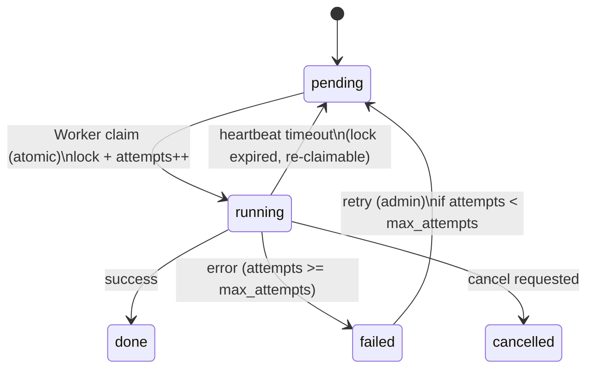
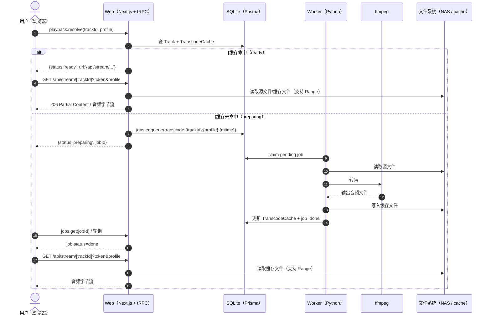
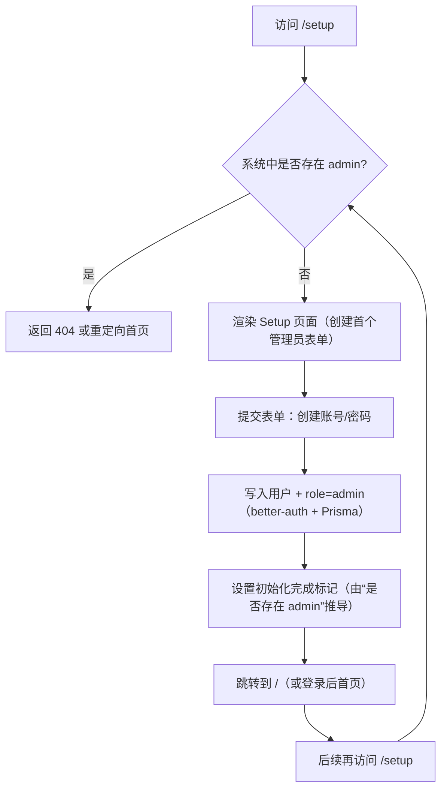

# 本地音乐管理工具（NAS 音乐库）— 方案A 设计稿（Next.js 16 + tRPC + Prisma(SQLite) + Python Worker）

日期：2026-04-01  
状态：草案（待确认后进入实现计划）  

## 1. 目标与约束（已确认）

### 1.1 产品目标（V1）
- 扫描 NAS 音乐目录并建立索引（tracks 为核心），支持增量更新
- Web 播放：内网原始直出；外网按档位转码（缓存）播放
- 整理维护：所有会修改文件/标签的动作必须 **Plan → 预览 → 确认 → 执行**
- 多用户：本地账号体系；管理员/普通用户两类角色；歌单与忽略按用户隔离
- docker compose 一键部署，核心依赖轻量（SQLite）

### 1.2 技术约束（你指定）
- Next.js：**Next 16（最新）**，App Router
- **不启用 Server Actions**（所有业务 API 走 tRPC）
- 数据库：SQLite + **Prisma**
- 管理员初始化：通过页面创建首个管理员
- Worker：按原设计继续用 **Python（mutagen + ffmpeg/ffprobe）**
- 包管理与工程组织：**pnpm + workspace**（单仓库管理 `web/` 与 `worker/`）

> 注：仍会保留少量“协议层例外”路由（见 3.3），但业务能力仍以 tRPC 为唯一入口。

## 2. 架构总览

### 2.1 组件
1) **Web（Next.js 16）**
- UI（PC 优先）
- tRPC（Control Plane / 业务控制面 API）
- Prisma（直接连 SQLite）
- 认证/授权：better-auth（Prisma adapter）

2) **Worker（Python）**
- 轮询/领取 SQLite `jobs` 表中的任务
- 执行：扫描、转码、Plan 执行（rename/move/tag write/cover/lyrics 等）
- 结果与进度回写 SQLite（jobs、tracks、plans、plan_items、transcode_cache）

3) **ffmpeg/ffprobe**
- 由 worker 子进程调用

4) **NAS 音乐目录（bind mount）**
- `web` 与 `worker` 均以 `:rw` 方式挂载（执行整理需要写权限）

### 2.2 数据流（关键路径）
- 扫描：Web 发起 `jobs.enqueue(scan_full/scan_incremental)` → Worker 执行并写入 `tracks`
- 播放（外网转码）：Web `playback.resolve(trackId, profile)` → 若缓存命中返回 stream URL；不命中则入队转码 job 并返回 jobId
- 整理：Web 创建 Plan（draft）→ preview 生成 plan_items 与 diff → admin confirm 冻结 → enqueue plan_execute → Worker 执行并更新 plan_items 状态 + 回写 tracks

## 3. API 设计（tRPC 为主）

### 3.1 约定
- tRPC 输入输出使用 Zod 校验
- 错误统一映射为 `{ code, message, details? }`（tRPC error shape）
- 所有 “会产生后台作业” 的调用返回 `{ jobId }` 或 `{ status, jobId?, ... }`

### 3.2 tRPC routers（建议拆分）
- `auth`：`me()`（其余登录注册走 better-auth 自带路由）
- `admin.settings`：`get()` / `update()`
- `jobs`：`list()` / `get(jobId)` / `retry(jobId)`（admin）
- `library`：`stats()`
- `tracks`：`list()` / `get(trackId)`
- `search`：`query(q, scope)`
- `playback`：`resolve(trackId, profile)`（返回可播放 URL 或 preparing job）
- `playlists`：CRUD + `items.add/remove/reorder`
- `ignored`：`list/add/remove`
- `plans`：
  - `create(type, scope, params)`
  - `preview(planId)`（生成/刷新 plan_items + diff）
  - `confirm(planId)`（admin）
  - `execute(planId)`（admin，enqueue job）
  - `get(planId)` / `items.list(planId, status)`

> 这些路由与你现有《需求与架构设计》中的 API 草案一一对应，只是从 `/api/...` 形态改为 tRPC procedure。

### 3.3 协议层例外（保留 Route Handler）
1) **better-auth 路由**
- `/api/auth/*`（由 better-auth 处理，tRPC 不重复实现）

2) **音频流媒体（必须支持 Range）**
- `GET /api/stream/[trackId]?...`：输出字节流（原始或转码缓存文件）
  - 必须正确处理 `Range` 请求头以支持 seek
  - 必须做鉴权（校验 session + token + track 权限）

> 说明：tRPC 不适合做 Range 字节流输出；保持该 handler 能显著降低实现复杂度与风险。

## 4. 数据库设计（Prisma + SQLite）

### 4.1 SQLite 文件与连接
- `DATABASE_URL=file:/data/app.db`（compose 卷挂载到 `/data`）
- SQLite 使用 WAL（见既有 `schema.sql`）

### 4.2 Prisma 建模范围
- better-auth 所需表（由 Prisma schema 统一管理）
- 业务/索引/任务：基于当前 `schema.sql` 等价迁移为 Prisma models
  - `Track`
  - `Playlist` / `PlaylistItem`
  - `UserIgnoredTrack`
  - `Plan` / `PlanItem`
  - `Job`
  - `TranscodeCache`
  - （可选）`UserSettings` / `AdminSettings`

### 4.3 搜索（FTS5）策略
SQLite FTS5 在 Prisma 中通常不直接建模为标准表关系：
- 方案：保留 `tracks_fts` 与 triggers 的 **raw SQL migration**
- tRPC `search.query` 使用 `prisma.$queryRaw` 做 FTS 查询，并映射返回 trackId 列表再回表取详情（或一次性 join）

## 5. 鉴权、授权与管理员初始化

### 5.1 鉴权
- Web 统一通过 better-auth session cookie 识别用户
- tRPC context：
  - 读取 session → `ctx.user`（含 `role`）
  - 未登录：抛 UNAUTHORIZED

### 5.1.1 路由保护（Next 16）
- 对需要“进入页面前就拦截”的路径（如 `/setup` 在初始化完成后应不可达），使用 Next 16 提供的请求拦截能力（你提到的 `proxy` 机制）做前置判断与重定向/404
- 其余大部分权限控制放在：
  - tRPC procedure 的鉴权/授权中间件
  - 以及必要的 Route Handler（`/api/stream/*`）里做二次校验

### 5.2 授权（V1 最小化）
- `admin`：设置、扫描、Plan confirm/execute、jobs retry
- `user`：播放、歌单、忽略、搜索、浏览

### 5.3 首个管理员初始化（/setup）
- 仅当系统中不存在管理员时：
  - `/setup` 页面可访问并创建首个管理员
  - 创建成功后写入 admin role，并将 `/setup` 永久禁用（或重定向到首页）
- 若已存在管理员：
  - 访问 `/setup` 返回 404 或跳转首页

安全要点：
- 必须检查“是否存在 admin”而不是“是否登录”
- 建议在 UI 显示明显提示：首次初始化完成后该入口将关闭

## 6. Jobs 队列与 Worker 设计（最佳实践落地）

### 6.1 Job 状态机
- `pending` → `running` → `done|failed|cancelled`
- 关键字段：`locked_by, locked_at, heartbeat_at, attempts, max_attempts, progress`

### 6.2 原子领取（避免双领）
Worker 领取时使用单条 SQL/事务保证原子性：
- 条件：`status='pending'` 且（未锁定或锁已超时）
- 更新：设置 `status='running'`, `locked_by`, `locked_at`, `heartbeat_at`, `attempts=attempts+1`

### 6.3 心跳与超时重领
- running job 每 N 秒刷新 `heartbeat_at`
- 超时：`heartbeat_at < now - timeout` 视为失联，可被重新领取
- 重试：`attempts >= max_attempts` 则不再领取（标记 failed）

### 6.4 幂等与去重
- 每类 job payload 必须携带：
  - `jobKey`（比如 `scan_full:{musicRoot}`、`transcode:{trackId}:{profile}:{sourceMtime}`、`plan_execute:{planId}`）
- Web 入队时可先检查是否已有同 `jobKey` 的 `pending/running`，避免重复入队
- Worker 执行前再次校验（最终保障）

## 7. 播放与流媒体（Range + Token）

### 7.1 playback.resolve（tRPC）
输入：`{ trackId, profile }`，profile 包含：
- `original`（直出原始文件）
- `mp3_192` / `aac_128` 等（可配置）

输出：
- 命中缓存：`{ status:'ready', url:'/api/stream/xxx?...', contentType }`
- 未命中：`{ status:'preparing', jobId, poll: { jobId } }`

### 7.2 stream handler（Route Handler）
- URL 携带短期 token（防止裸链）
- 读取并校验：
  - session（用户已登录）
  - token（签名 + 过期 + 与用户/track/profile 绑定）
- 输出：
  - `profile=original`：输出源文件（支持 Range）
  - `profile!=original`：输出缓存文件（支持 Range）

## 8. Plan（预览 → 确认 → 执行）落地细节

### 8.1 Plan preview 的职责
- 生成/刷新 `plan_items`
- 做冲突/权限/非法字符等预校验，写入 `warnings_json`
- 生成“可视化 diff”：路径变更 + tags diff + 封面/歌词变更摘要

### 8.2 confirm 冻结
- `confirm` 后 plan 的 scope/params 不可变，确保 preview 与执行一致

### 8.3 执行与回滚边界（V1）
- rename/move：尽力原子 rename；失败则记录并尝试回滚
- tag 写回：单文件事务化（失败记录，可继续/中止由策略控制）
- 回滚：默认“尽力回滚”，不承诺强一致（强一致需备份副本，V1 不做）

## 9. 非功能需求（V1 重点）
- 库规模：1–10 万首
- 搜索：热缓存常用查询 < 300ms（FTS5）
- 转码并发：可配置上限（避免打满 CPU）
- 可运维：任务中心 + 失败原因 + 重试；SQLite 备份建议（DB + WAL）

## 10. 里程碑与交付物（用于实现计划）
- M0：工程骨架 + Prisma migrations + auth + /setup + jobs 体系跑通 + 扫描全量（最小可用）+ 库浏览/搜索（FTS）
- M1：播放（original + 1 个转码档位）+ 转码缓存
- M2：Plan（rename/tag_write）+ Plan diff UI + 执行器 + 任务中心
- M3：歌单/忽略 + 多用户体验完善
- M4：配置页、运维与错误处理打磨

---

## 附录 A：Mermaid 图（实施计划 Task 2）

### A.1 Jobs 状态机

### A.2 播放时序（resolve → stream / transcode）

### A.3 `/setup` 流程（首个管理员初始化）

